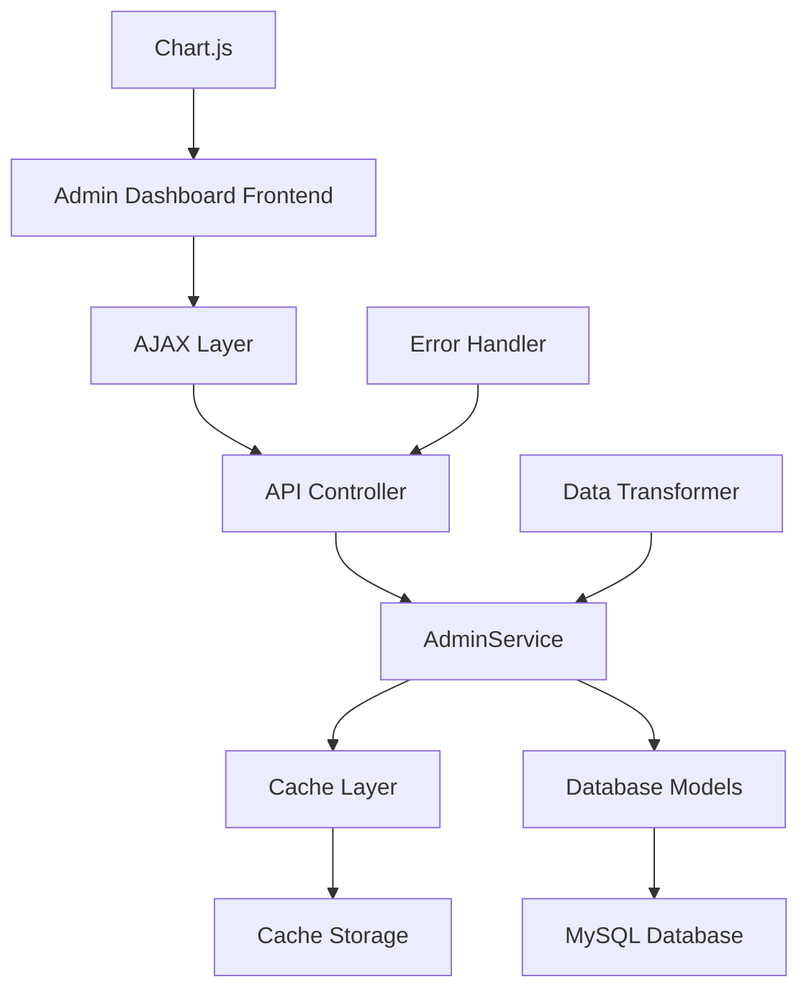

# Design Document

## Overview

Thiết kế này chuyển đổi admin dashboard từ việc sử dụng dữ liệu hardcode sang dữ liệu động từ database. Hệ thống sẽ tạo các API endpoints RESTful, implement caching layer, và sử dụng AJAX để tải dữ liệu bất đồng bộ. Thiết kế tận dụng cơ sở hạ tầng hiện có (AdminService, ErrorHandler, Models) và mở rộng để hỗ trợ real-time data.

## Architecture

### High-Level Architecture



### Data Flow

1. **Initial Load**: Dashboard tải với skeleton UI, sau đó gửi AJAX requests để lấy dữ liệu
2. **Cache Check**: API kiểm tra cache trước khi query database
3. **Data Processing**: AdminService xử lý và transform dữ liệu
4. **Response**: API trả về JSON data cho frontend
5. **Chart Rendering**: Chart.js render biểu đồ với dữ liệu mới

### Integration Points

- **Existing AdminService**: Mở rộng với các methods mới cho dashboard data
- **Current Models**: Sử dụng OrdersModel, ProductsModel, UsersModel, EventsModel, NewsModel
- **Error Handling**: Tích hợp với ErrorHandler hiện có
- **Authentication**: Sử dụng middleware authentication hiện có

## Components and Interfaces

### 1. API Controller (AdminDashboardController)

```php
class AdminDashboardController extends BaseController
{
    private AdminService $adminService;
    private CacheService $cacheService;
    
    public function getRevenueData(Request $request): JsonResponse
    public function getTopProductsData(Request $request): JsonResponse  
    public function getOrdersStatusData(Request $request): JsonResponse
    public function getNewUsersData(Request $request): JsonResponse
    public function getDashboardStats(Request $request): JsonResponse
    public function getAllDashboardData(Request $request): JsonResponse
}
```

### 2. Enhanced AdminService

```php
// Existing AdminService với methods mới
class AdminService extends BaseService
{
    // Existing methods...
    
    public function getDashboardRevenueData(array $filters = []): array
    public function getDashboardTopProducts(int $limit = 5): array
    public function getDashboardOrdersStatus(): array
    public function getDashboardNewUsers(string $period = '4weeks'): array
    public function getDashboardStatistics(): array
    public function getDashboardChartsData(array $filters = []): array
}
```

### 3. Cache Service

```php
class CacheService
{
    private string $cacheDir;
    private array $ttlConfig;
    
    public function get(string $key): ?array
    public function set(string $key, array $data, int $ttl = 300): bool
    public function delete(string $key): bool
    public function flush(string $pattern = ''): bool
    public function generateKey(string $type, array $params = []): string
}
```

### 4. Frontend AJAX Layer

```javascript
class DashboardDataLoader {
    constructor(baseUrl, options = {}) {
        this.baseUrl = baseUrl;
        this.timeout = options.timeout || 30000;
        this.retryCount = options.retryCount || 2;
    }
    
    async loadRevenueData(period = '30days') {}
    async loadTopProducts(limit = 5) {}
    async loadOrdersStatus() {}
    async loadNewUsers(period = '4weeks') {}
    async loadDashboardStats() {}
    async loadAllData(filters = {}) {}
}
```

### 5. Chart Data Adapters

```javascript
class ChartDataAdapter {
    static adaptRevenueData(apiData) {}
    static adaptTopProductsData(apiData) {}
    static adaptOrdersStatusData(apiData) {}
    static adaptNewUsersData(apiData) {}
}
```

## Data Models

### API Response Formats

#### Revenue Data Response
```json
{
    "success": true,
    "data": {
        "labels": ["Tuần 1", "Tuần 2", "Tuần 3", "Tuần 4"],
        "datasets": [{
            "label": "Doanh thu (triệu VNĐ)",
            "data": [12.5, 19.2, 15.8, 25.3],
            "period": "30days",
            "total": 67.8,
            "currency": "VND"
        }]
    },
    "meta": {
        "period": "30days",
        "generated_at": "2024-01-15T10:30:00Z",
        "cache_hit": true
    }
}
```

#### Top Products Response
```json
{
    "success": true,
    "data": {
        "products": [
            {
                "id": 1,
                "name": "Data Premium",
                "sales_count": 45,
                "revenue": 22500000,
                "percentage": 35.2
            }
        ],
        "total_products": 5,
        "total_sales": 145,
        "total_revenue": 63900000
    }
}
```

#### Orders Status Response
```json
{
    "success": true,
    "data": {
        "labels": ["Hoàn thành", "Đang xử lý", "Chờ xử lý", "Đã hủy"],
        "datasets": [{
            "data": [65, 20, 10, 5],
            "backgroundColor": ["#10B981", "#3B82F6", "#F59E0B", "#EF4444"]
        }],
        "totals": {
            "completed": 130,
            "processing": 40,
            "pending": 20,
            "cancelled": 10
        }
    }
}
```

#### Dashboard Statistics Response
```json
{
    "success": true,
    "data": {
        "total_products": 156,
        "total_revenue": 125600000,
        "published_news": 23,
        "upcoming_events": 8,
        "trends": {
            "products": {"direction": "up", "value": 12.5},
            "revenue": {"direction": "up", "value": 8.3},
            "news": {"direction": "down", "value": -2.1},
            "events": {"direction": "up", "value": 15.7}
        }
    }
}
```

### Database Queries

#### Revenue Data Query
```sql
SELECT 
    DATE(created_at) as date,
    SUM(total) as revenue,
    COUNT(*) as orders_count
FROM orders 
WHERE status = 'completed' 
    AND created_at >= ? 
    AND created_at <= ?
GROUP BY DATE(created_at)
ORDER BY date ASC
```

#### Top Products Query
```sql
SELECT 
    p.id, p.name, p.price,
    COUNT(oi.id) as sales_count,
    SUM(oi.price * oi.quantity) as revenue
FROM products p
JOIN order_items oi ON p.id = oi.product_id
JOIN orders o ON oi.order_id = o.id
WHERE o.status = 'completed'
    AND o.created_at >= ?
    AND o.created_at <= ?
GROUP BY p.id, p.name, p.price
ORDER BY sales_count DESC
LIMIT ?
```

### Cache Keys Structure

```
dashboard:revenue:{period}:{date_from}:{date_to}
dashboard:top_products:{limit}:{date_from}:{date_to}
dashboard:orders_status:{date_from}:{date_to}
dashboard:new_users:{period}
dashboard:stats:general
```

## Error Handling

### Error Response Format
```json
{
    "success": false,
    "error": {
        "code": "DATABASE_ERROR",
        "message": "Không thể kết nối database",
        "details": "Connection timeout after 30 seconds"
    },
    "fallback_data": {
        "labels": [],
        "datasets": []
    }
}
```

### Error Handling Strategy

1. **Database Errors**: Log error, return fallback data, show user-friendly message
2. **Cache Errors**: Fallback to database query, log warning
3. **API Timeout**: Retry mechanism, progressive timeout (5s, 10s, 15s)
4. **Invalid Parameters**: Return HTTP 400 with validation errors
5. **Authentication Errors**: Return HTTP 401, redirect to login

### Fallback Data

```javascript
const FALLBACK_DATA = {
    revenue: {
        labels: ['Không có dữ liệu'],
        datasets: [{ data: [0], label: 'Doanh thu' }]
    },
    topProducts: {
        products: [],
        message: 'Chưa có dữ liệu sản phẩm'
    },
    ordersStatus: {
        labels: ['Chưa có đơn hàng'],
        datasets: [{ data: [0] }]
    }
};
```

## Testing Strategy

### Unit Testing
- **AdminService Methods**: Test các methods mới với mock data
- **Cache Service**: Test cache operations (get, set, delete, flush)
- **API Controller**: Test response formats và error handling
- **Data Transformers**: Test data transformation logic

### Integration Testing
- **API Endpoints**: Test end-to-end API calls với real database
- **Database Queries**: Test query performance và accuracy
- **Cache Integration**: Test cache hit/miss scenarios
- **Error Scenarios**: Test fallback mechanisms

### Property-Based Testing
- **Chart Data Consistency**: Test data integrity across different periods
- **Cache Invalidation**: Test cache behavior với data updates
- **API Response Format**: Test response structure consistency

### Performance Testing
- **Load Testing**: Test API performance với concurrent requests
- **Database Performance**: Test query execution time
- **Cache Performance**: Test cache hit ratio và response time
- **Frontend Performance**: Test AJAX loading times

### Browser Testing
- **Chart Rendering**: Test Chart.js với different data sets
- **AJAX Error Handling**: Test network failures và timeouts
- **UI Responsiveness**: Test loading states và error messages
- **Cross-browser Compatibility**: Test trên Chrome, Firefox, Safari, Edge

## Correctness Properties

*A property is a characteristic or behavior that should hold true across all valid executions of a system-essentially, a formal statement about what the system should do. Properties serve as the bridge between human-readable specifications and machine-verifiable correctness guarantees.*

### Property Reflection

After analyzing all acceptance criteria, I identified several areas where properties can be consolidated:

- **Caching properties** (1.5, 2.5, 4.5, 8.2, 8.3, 8.6) can be combined into comprehensive cache behavior properties
- **API response format properties** (1.4, 2.3, 3.4, 4.4, 7.1-7.5) can be consolidated into API consistency properties  
- **Data source properties** (1.1, 2.1, 3.1, 4.1, 5.1-5.4) can be combined into database integration properties
- **Error handling properties** (6.3, 9.1, 9.2, 9.4, 11.5) can be unified into comprehensive error handling properties

### Core Properties

**Property 1: Dashboard Data Integration**
*For any* admin dashboard request, all chart data should be sourced from the database (orders, products, users, events, news tables) rather than hardcoded values, and the data should accurately reflect the current database state
**Validates: Requirements 1.1, 2.1, 3.1, 4.1, 5.1, 5.2, 5.3, 5.4, 10.1, 10.5**

**Property 2: Period Filter Consistency**
*For any* valid time period filter (7 days, 30 days, 12 months), the returned chart data should only include records within that period, and changing the period should update all relevant charts accordingly
**Validates: Requirements 1.2, 10.2, 10.3**

**Property 3: API Response Format Consistency**
*For any* dashboard API endpoint, the response should follow the standardized JSON format with success/error status, data payload, and metadata, ensuring Chart.js compatibility
**Validates: Requirements 1.4, 2.3, 3.4, 4.4, 7.1, 7.2, 7.3, 7.4, 7.5**

**Property 4: Top Products Ranking Accuracy**
*For any* set of orders and products, the top products calculation should correctly rank products by sales count/revenue within the specified period, and deleted products should not appear in results
**Validates: Requirements 2.2, 2.4**

**Property 5: Order Status Distribution Completeness**
*For any* set of orders, the status distribution chart should include all four required statuses (completed, processing, pending, cancelled) with accurate counts and percentages
**Validates: Requirements 3.2, 3.4**

**Property 6: Cache Behavior Consistency**
*For any* dashboard data request, the cache system should store data with appropriate TTL (5min for revenue, 10min for products, 15min for users), serve cached data on cache hits, and fallback to database on cache misses or errors
**Validates: Requirements 1.5, 2.5, 4.5, 8.1, 8.2, 8.3, 8.5, 8.6**

**Property 7: Cache Invalidation on Data Changes**
*For any* data modification (orders, products, users), related cache entries should be automatically invalidated to ensure data consistency
**Validates: Requirements 3.3, 4.3, 5.5, 8.4**

**Property 8: API Authentication and Authorization**
*For any* dashboard API endpoint request, admin authentication should be required, and unauthorized requests should return HTTP 401 with appropriate error messages
**Validates: Requirements 7.7**

**Property 9: API Error Handling**
*For any* invalid API request parameters, the endpoint should return HTTP 400 with clear error messages, and for any system errors, appropriate HTTP status codes should be returned with fallback data
**Validates: Requirements 7.6, 9.1, 9.2**

**Property 10: AJAX Timeout and Retry Behavior**
*For any* AJAX request that times out, the system should retry up to 2 times with 30-second timeout, and display appropriate error messages with fallback data if all retries fail
**Validates: Requirements 6.4, 9.4**

**Property 11: Error Logging Completeness**
*For any* system error (database, cache, API), the error should be logged with sufficient detail for debugging, including timestamp, error type, and context information
**Validates: Requirements 9.3**

**Property 12: Performance Response Time**
*For any* normal dashboard API request, the response time should be under 2 seconds, and large datasets should be properly paginated to maintain performance
**Validates: Requirements 12.1, 12.4**

**Property 13: JavaScript Hardcode Elimination**
*For any* dashboard JavaScript file (admin_dashboard.js, admin_events.js, admin_news.js), no hardcoded data arrays should exist, and all data should be loaded via AJAX requests
**Validates: Requirements 11.1, 11.2, 11.3, 11.4**

**Property 14: Frontend Error Handling**
*For any* AJAX request failure, the frontend should display appropriate error messages, show fallback data or empty states, and maintain UI functionality
**Validates: Requirements 6.3, 9.2, 11.5**

### Example Test Cases

**Example 1: Empty State Handling**
When no revenue data exists in the database, the dashboard should display an empty chart with the message "Không có dữ liệu doanh thu"
**Validates: Requirements 1.3**

**Example 2: No Orders Empty State**
When no orders exist in the database, the orders status chart should display the message "Chưa có đơn hàng"
**Validates: Requirements 3.5**

**Example 3: Initial Dashboard Load**
When an admin first loads the dashboard, AJAX requests should be automatically sent to load all chart data
**Validates: Requirements 6.1**

**Example 4: Period Filter Change**
When an admin changes the reporting period dropdown, AJAX requests should be sent to update chart data without page reload
**Validates: Requirements 6.2**

**Example 5: Loading State Display**
When dashboard data is being loaded via AJAX, loading indicators should be displayed to the user
**Validates: Requirements 6.5**

**Example 6: Database Index Optimization**
The database should have proper indexes on frequently queried fields (orders.created_at, orders.status, products.status, users.created_at)
**Validates: Requirements 12.2**

**Example 7: AJAX Compression**
AJAX requests should include appropriate compression headers to reduce bandwidth usage
**Validates: Requirements 12.3**