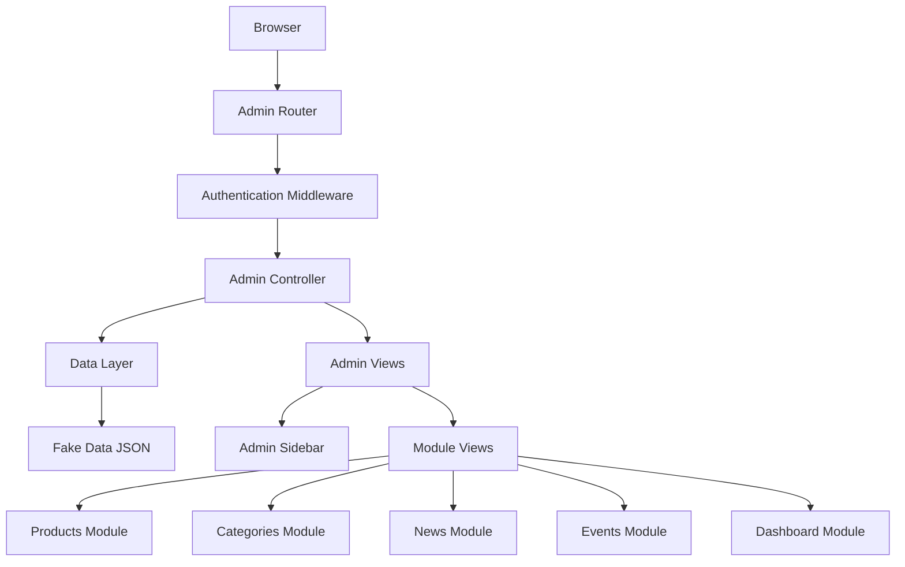

# Tài liệu Thiết kế - Hệ thống Admin Panel

## Tổng quan

Hệ thống Admin Panel được thiết kế như một module mở rộng cho website PHP hiện tại, sử dụng cấu trúc MVC đã có và tích hợp mượt mà với hệ thống authentication. Thiết kế tập trung vào tính modular, bảo mật và khả năng mở rộng, với giao diện responsive và trải nghiệm người dùng tối ưu.

## Kiến trúc

### Kiến trúc Tổng thể



### Cấu trúc Thư mục

```
app/views/admin/
├── data/
│   └── fake_data.json          # Dữ liệu demo
├── dashboard/
│   └── index.php               # Dashboard chính
├── products/
│   ├── index.php               # Danh sách sản phẩm
│   ├── change.php              # Thêm/sửa sản phẩm
│   └── delete.php              # Xóa sản phẩm
├── categories/
│   ├── index.php               # Danh sách danh mục
│   ├── change.php              # Thêm/sửa danh mục
│   └── delete.php              # Xóa danh mục
├── news/
│   ├── index.php               # Danh sách tin tức
│   ├── change.php              # Thêm/sửa tin tức
│   └── delete.php              # Xóa tin tức
└── events/
    ├── index.php               # Danh sách sự kiện
    ├── change.php              # Thêm/sửa sự kiện
    └── delete.php              # Xóa sự kiện

app/views/_layout/
└── admin_sidebar.php           # Sidebar navigation

assets/css/
├── admin.css                   # CSS chung cho admin
└── admin_sidebar.css           # CSS cho sidebar

assets/js/
├── admin.js                    # JavaScript chung cho admin
└── admin_sidebar.js            # JavaScript cho sidebar
```

## Thành phần và Giao diện

### 1. Admin Sidebar Component

**Chức năng:**
- Navigation menu với các module chính
- Responsive design với toggle cho mobile
- Active state highlighting
- User info display

**Cấu trúc HTML:**
```html
<aside class="admin-sidebar">
    <div class="sidebar-header">
        <h3>Admin Panel</h3>
        <button class="sidebar-toggle">☰</button>
    </div>
    <nav class="sidebar-nav">
        <ul class="nav-menu">
            <li><a href="?page=admin&module=dashboard">Dashboard</a></li>
            <li><a href="?page=admin&module=products">Sản phẩm</a></li>
            <li><a href="?page=admin&module=categories">Danh mục</a></li>
            <li><a href="?page=admin&module=news">Tin tức</a></li>
            <li><a href="?page=admin&module=events">Sự kiện</a></li>
        </ul>
    </nav>
</aside>
```

### 2. Admin Layout Integration

**Master Layout Modification:**
- Detect admin pages và load admin-specific CSS/JS
- Conditional sidebar inclusion
- Admin-specific header modifications

**Layout Structure:**
```php
<?php if ($isAdminPage): ?>
    <div class="admin-layout">
        <?php include 'admin_sidebar.php'; ?>
        <main class="admin-content">
            <?php echo $content; ?>
        </main>
    </div>
<?php else: ?>
    <!-- Regular layout -->
<?php endif; ?>
```

### 3. Module Components

#### Products Module
- **index.php**: Danh sách sản phẩm với pagination, search, filter
- **change.php**: Form thêm/sửa sản phẩm với validation
- **delete.php**: Xác nhận và xử lý xóa sản phẩm

#### Categories Module
- **index.php**: Danh sách danh mục với hierarchy display
- **change.php**: Form quản lý danh mục với parent selection
- **delete.php**: Kiểm tra dependency trước khi xóa

#### News Module
- **index.php**: Danh sách bài viết với status filter
- **change.php**: Rich text editor cho nội dung
- **delete.php**: Soft delete với restore option

#### Events Module
- **index.php**: Calendar view và list view
- **change.php**: Date picker và location management
- **delete.php**: Event cancellation handling

### 4. Data Management Layer

**Fake Data Structure:**
```json
{
    "products": [
        {
            "id": 1,
            "name": "Sản phẩm 1",
            "price": 100000,
            "category_id": 1,
            "status": "active",
            "created_at": "2024-01-01"
        }
    ],
    "categories": [
        {
            "id": 1,
            "name": "Danh mục 1",
            "description": "Mô tả danh mục",
            "parent_id": null
        }
    ],
    "news": [
        {
            "id": 1,
            "title": "Tin tức 1",
            "content": "Nội dung tin tức",
            "status": "published",
            "created_at": "2024-01-01"
        }
    ],
    "events": [
        {
            "id": 1,
            "name": "Sự kiện 1",
            "start_date": "2024-02-01",
            "end_date": "2024-02-02",
            "location": "Hà Nội"
        }
    ]
}
```

## Mô hình Dữ liệu

### Product Model
```php
class Product {
    public $id;
    public $name;
    public $description;
    public $price;
    public $category_id;
    public $image;
    public $status; // active, inactive
    public $created_at;
    public $updated_at;
}
```

### Category Model
```php
class Category {
    public $id;
    public $name;
    public $description;
    public $parent_id;
    public $sort_order;
    public $status;
    public $created_at;
}
```

### News Model
```php
class News {
    public $id;
    public $title;
    public $summary;
    public $content;
    public $image;
    public $status; // draft, published, archived
    public $author_id;
    public $created_at;
    public $published_at;
}
```

### Event Model
```php
class Event {
    public $id;
    public $name;
    public $description;
    public $start_date;
    public $end_date;
    public $location;
    public $max_participants;
    public $status; // upcoming, ongoing, completed, cancelled
    public $created_at;
}
```

## Thuộc tính Đúng đắn (Correctness Properties)

*Thuộc tính đúng đắn là các đặc tính hoặc hành vi phải đúng trong tất cả các lần thực thi hợp lệ của hệ thống - về cơ bản là các phát biểu chính thức về những gì hệ thống nên làm. Các thuộc tính này đóng vai trò là cầu nối giữa các đặc tả có thể đọc được bởi con người và các đảm bảo đúng đắn có thể xác minh bằng máy.*

### Property 1: Sidebar Menu Completeness
*Với bất kỳ* trang admin nào, sidebar phải chứa tất cả các menu items bắt buộc: dashboard, sản phẩm, danh mục, tin tức, sự kiện
**Validates: Requirements 1.1**

### Property 2: Navigation State Consistency  
*Với bất kỳ* menu item nào được click, hệ thống phải điều hướng đến URL tương ứng và highlight menu đang active
**Validates: Requirements 1.2**

### Property 3: Resource Loading Integrity
*Với bất kỳ* trang admin nào, hệ thống phải load đúng các CSS và JS files tương ứng (admin.css, admin.js, admin_sidebar.css, admin_sidebar.js)
**Validates: Requirements 1.3, 2.3**

### Property 4: Module Structure Consistency
*Với bất kỳ* module nào (products, categories, news, events), folder phải chứa đầy đủ các files: index.php, change.php, delete.php
**Validates: Requirements 2.2**

### Property 5: Data Loading Round Trip
*Với bất kỳ* module nào, dữ liệu được load từ fake_data.json phải được hiển thị chính xác và cập nhật lại JSON khi có thay đổi
**Validates: Requirements 3.1, 4.1, 5.1, 6.1, 10.1, 10.2**

### Property 6: Data Display Completeness
*Với bất kỳ* record nào trong bất kỳ module nào, tất cả các fields bắt buộc phải được hiển thị (tên, giá cho products; tên, mô tả cho categories; v.v.)
**Validates: Requirements 3.2, 4.2, 5.2, 6.2**

### Property 7: Form Validation Consistency
*Với bất kỳ* form submission nào, các validation rules phải được áp dụng (required fields, date logic, business rules)
**Validates: Requirements 4.3, 5.4, 6.3**

### Property 8: Authentication Gate
*Với bất kỳ* admin page request nào, hệ thống phải kiểm tra authentication và redirect về login nếu chưa đăng nhập
**Validates: Requirements 7.1, 7.2**

### Property 9: Responsive Layout Adaptation
*Với bất kỳ* viewport size nào, giao diện admin phải điều chỉnh layout phù hợp (fixed sidebar cho desktop, collapsible cho mobile)
**Validates: Requirements 8.1, 8.2, 8.3, 8.4**

### Property 10: System Integration Consistency
*Với bất kỳ* admin operation nào, hệ thống phải sử dụng các core components hiện có (master.php, database.php, UrlBuilder.php, functions.php)
**Validates: Requirements 9.2, 9.3, 9.4, 9.5**

### Property 11: JSON Data Integrity
*Với bất kỳ* JSON operation nào, hệ thống phải xử lý lỗi gracefully và đảm bảo data integrity (tạo file mặc định nếu không tồn tại, backup khi ghi)
**Validates: Requirements 10.3, 10.4, 10.5**

### Property 12: Deletion Confirmation Flow
*Với bất kỳ* delete operation nào, hệ thống phải hiển thị confirmation dialog và chỉ thực hiện xóa khi được xác nhận
**Validates: Requirements 3.4, 5.5, 6.5**

## Xử lý Lỗi

### 1. Authentication Errors
- **Session Expired**: Redirect về login với thông báo
- **Insufficient Permissions**: Hiển thị 403 error page
- **Invalid Credentials**: Hiển thị error message trên login form

### 2. Data Errors
- **JSON File Corrupt**: Tạo backup và khởi tạo dữ liệu mặc định
- **File Permission Issues**: Hiển thị error message và hướng dẫn fix
- **Invalid Data Format**: Validation errors với specific field messages

### 3. UI Errors
- **Resource Loading Failed**: Fallback CSS/JS hoặc graceful degradation
- **Mobile Compatibility**: Progressive enhancement approach
- **Browser Compatibility**: Feature detection và polyfills

### 4. Business Logic Errors
- **Dependency Violations**: Prevent deletion với clear error message
- **Data Integrity Issues**: Rollback changes và notify user
- **Validation Failures**: Highlight problematic fields với specific messages

## Chiến lược Testing

### Dual Testing Approach

Hệ thống sử dụng kết hợp **unit tests** và **property-based tests** để đảm bảo coverage toàn diện:

**Unit Tests** tập trung vào:
- Specific examples và edge cases
- Integration points giữa các components
- Error conditions và exception handling
- UI interactions cụ thể

**Property-Based Tests** tập trung vào:
- Universal properties áp dụng cho tất cả inputs
- Comprehensive input coverage thông qua randomization
- Data integrity và consistency
- Business rules validation

### Property-Based Testing Configuration

- **Framework**: PHPUnit với Eris library cho property-based testing
- **Iterations**: Minimum 100 iterations per property test
- **Test Tagging**: Mỗi property test được tag với format:
  ```php
  /**
   * @test
   * Feature: admin-panel-system, Property 1: Sidebar Menu Completeness
   */
  ```

### Testing Strategy cho từng Module

**Sidebar Navigation Testing**:
- Unit tests: Specific menu clicks và active states
- Property tests: Menu completeness và navigation consistency

**Data Management Testing**:
- Unit tests: Specific CRUD operations
- Property tests: Data integrity và round-trip consistency

**Authentication Testing**:
- Unit tests: Login/logout flows
- Property tests: Access control consistency

**Responsive Design Testing**:
- Unit tests: Specific breakpoint behaviors
- Property tests: Layout adaptation across viewport sizes

### Test Data Management

- **Fake Data Generation**: Automated generation của test data
- **Data Isolation**: Mỗi test sử dụng isolated fake_data.json copy
- **Cleanup**: Automatic cleanup sau mỗi test run
- **Backup/Restore**: Test data backup và restore mechanisms