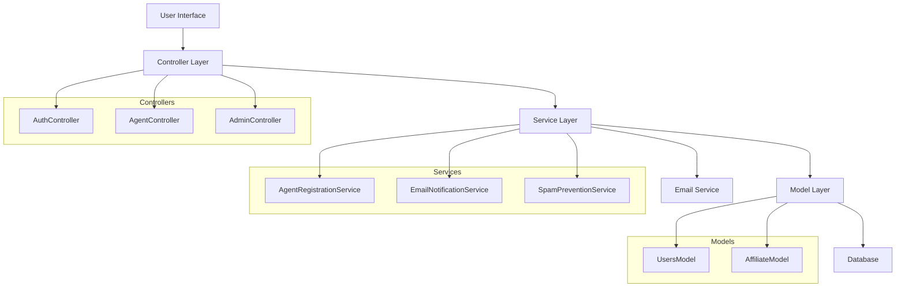

# Design Document: Agent Registration System

## Overview

Hệ thống đăng ký đại lý được thiết kế để tích hợp mượt mà với cấu trúc PHP MVC hiện tại, cung cấp hai luồng đăng ký khác nhau cho người dùng mới và hiện tại. Hệ thống sử dụng pattern MVC với các service classes để xử lý business logic, tích hợp với authentication system hiện có và PHPMailer để gửi email thông báo.

## Architecture

Hệ thống được xây dựng trên kiến trúc MVC hiện tại với các thành phần bổ sung:



## Components and Interfaces

### 1. AgentRegistrationService

Service chính xử lý logic đăng ký đại lý:

```php
class AgentRegistrationService {
    public function registerNewUserAsAgent($userData, $agentData): RegistrationResult
    public function upgradeExistingUserToAgent($userId, $agentData): RegistrationResult
    public function checkExistingRequest($userId): ?AgentRequest
    public function preventSpamSubmission($userId): bool
}
```

### 2. EmailNotificationService

Service xử lý gửi email thông báo:

```php
class EmailNotificationService {
    public function sendRegistrationConfirmation($userEmail, $userName): bool
    public function sendApprovalNotification($userEmail, $userName): bool
    public function sendProcessingNotification($userEmail, $userName): bool
}
```

### 3. SpamPreventionService

Service ngăn chặn spam và rate limiting:

```php
class SpamPreventionService {
    public function isRateLimited($userId): bool
    public function recordSubmission($userId): void
    public function hasExistingPendingRequest($userId): bool
}
```

### 4. AgentController

Controller mới xử lý các request liên quan đến đại lý:

```php
class AgentController extends BaseController {
    public function showRegistrationPopup()
    public function processRegistration()
    public function checkStatus()
    public function showProcessingMessage()
}
```

### 5. Enhanced AuthController

Mở rộng AuthController hiện tại để hỗ trợ đăng ký đại lý:

```php
// Thêm methods vào AuthController hiện tại
public function registerWithAgentOption()
public function processRegistrationWithRole()
```

### 6. Enhanced AdminController

Mở rộng AdminController để quản lý đại lý:

```php
// Thêm methods vào AdminController hiện tại
public function manageAgentRequests()
public function approveAgentRequest($requestId)
public function updateAgentStatus($requestId, $status)
```

## Data Models

### Enhanced Users Table

Bảng users hiện tại được mở rộng với các trường:

```sql
-- Thêm vào bảng users hiện có
ALTER TABLE users ADD COLUMN agent_request_status ENUM('none', 'pending', 'approved', 'rejected') DEFAULT 'none';
ALTER TABLE users ADD COLUMN agent_request_date TIMESTAMP NULL;
ALTER TABLE users ADD COLUMN agent_approved_date TIMESTAMP NULL;
```

### Enhanced Affiliates Table

Bảng affiliates hiện tại được sử dụng để lưu thông tin đại lý:

```sql
-- Bảng affiliates hiện có sẽ được sử dụng với cấu trúc:
-- id, user_id, status, created_at, updated_at, additional_info (JSON)
```

### Agent Registration Request Data Structure

```php
class AgentRegistrationData {
    public $userId;
    public $email; // Gmail bắt buộc
    public $additionalInfo; // JSON data
    public $requestType; // 'new_user' hoặc 'existing_user'
    public $status; // 'pending', 'approved', 'rejected'
    public $submittedAt;
    public $processedAt;
}
```

## Correctness Properties

*A property is a characteristic or behavior that should hold true across all valid executions of a system-essentially, a formal statement about what the system should do. Properties serve as the bridge between human-readable specifications and machine-verifiable correctness guarantees.*

### Property 1: Navigation redirects work consistently
*For any* new user clicking agent registration buttons or CTAs, the system should redirect them to the registration page
**Validates: Requirements 1.1**

### Property 2: Registration form displays role options
*For any* new user completing the registration form, the system should display both regular user and agent role options
**Validates: Requirements 1.2**

### Property 3: Agent account creation with correct status
*For any* new user selecting the agent option, the system should create an account with temporary user access and pending agent status
**Validates: Requirements 1.3**

### Property 4: Email notifications are sent for all registrations
*For any* agent registration request (new or existing user), the system should send appropriate confirmation or success emails using PHPMailer
**Validates: Requirements 1.4, 2.3, 5.1, 5.2, 5.3**

### Property 5: Pending users see processing messages consistently
*For any* user with pending agent status, clicking agent buttons or CTAs should display only processing notification messages
**Validates: Requirements 1.5, 2.4, 4.4**

### Property 6: Existing users get registration popup
*For any* existing user clicking agent registration buttons or CTAs, the system should display the agent registration popup
**Validates: Requirements 2.1**

### Property 7: Gmail validation is enforced
*For any* agent registration submission, the system should require and validate a Gmail address
**Validates: Requirements 2.2**

### Property 8: Admin panels display correct user information
*For any* admin viewing user or agent tabs, the system should display users and requests with correct roles and statuses
**Validates: Requirements 3.1, 3.2**

### Property 9: Status updates process correctly
*For any* admin changing agent status from pending to active, the system should approve the registration and update user roles
**Validates: Requirements 3.3, 3.5**

### Property 10: Duplicate submissions are prevented
*For any* user with an existing agent registration request, the system should prevent duplicate submissions and display existing request status
**Validates: Requirements 4.1, 4.2**

### Property 11: Rate limiting is enforced
*For any* user exhibiting potential spam behavior, the system should implement rate limiting for registration requests
**Validates: Requirements 4.3**

### Property 12: Email error handling works correctly
*For any* email sending failure, the system should log the error but continue with the registration process
**Validates: Requirements 5.4**

## Error Handling

### 1. Email Service Failures
- Log email failures using existing logging system
- Continue registration process even if email fails
- Provide fallback notification mechanisms
- Retry email sending with exponential backoff

### 2. Database Operation Failures
- Implement transaction rollback for failed registrations
- Provide meaningful error messages to users
- Log database errors for admin review
- Maintain data consistency across users and affiliates tables

### 3. Spam Detection and Rate Limiting
- Implement configurable rate limits per user/IP
- Use session-based tracking for anonymous users
- Provide clear error messages for rate-limited users
- Log suspicious activity for security monitoring

### 4. Validation Errors
- Validate Gmail addresses using proper regex patterns
- Sanitize all user inputs to prevent XSS/SQL injection
- Provide client-side and server-side validation
- Return specific validation error messages

### 5. Authentication Integration Failures
- Handle cases where existing auth system is unavailable
- Provide graceful degradation for auth-dependent features
- Maintain session consistency during registration process
- Log authentication-related errors

## Testing Strategy

### Dual Testing Approach

The system will use both unit testing and property-based testing for comprehensive coverage:

**Unit Tests:**
- Specific examples of successful registrations
- Edge cases like invalid email formats
- Error conditions like database failures
- Integration points between components
- Admin approval workflows

**Property-Based Tests:**
- Universal properties across all user inputs
- Comprehensive input coverage through randomization
- Minimum 100 iterations per property test
- Each test tagged with feature and property reference

### Property-Based Testing Configuration

Using PHPUnit with a property-based testing library (such as Eris for PHP):

- **Minimum 100 iterations** per property test
- Each property test references its design document property
- **Tag format:** `Feature: agent-registration-system, Property {number}: {property_text}`
- Each correctness property implemented by a single property-based test

### Testing Focus Areas

**Property Tests:**
- Email sending behavior across all registration types
- Status update consistency for all users
- Spam prevention across different user behaviors
- UI consistency for all user states

**Unit Tests:**
- Specific Gmail validation examples
- Database transaction rollback scenarios
- PHPMailer integration points
- Admin interface specific workflows

### Integration Testing

- Test complete registration flows from UI to database
- Verify email integration with PHPMailer
- Test admin approval workflows end-to-end
- Validate authentication system integration