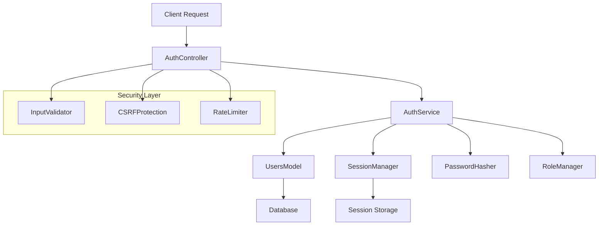
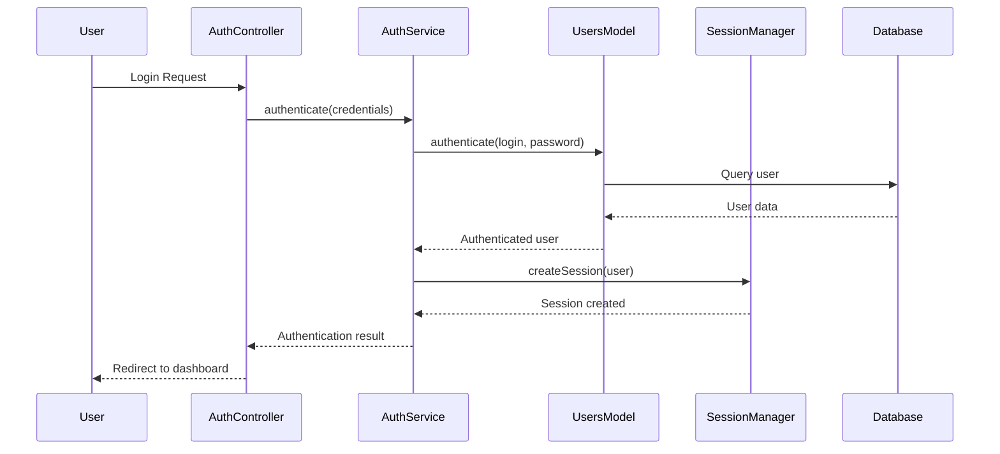

# Design Document - PHP Authentication System

## Overview

Hệ thống authentication PHP được thiết kế để tích hợp hoàn hảo với kiến trúc MVC hiện tại, sử dụng các pattern và cấu trúc đã có. Hệ thống sẽ cung cấp authentication an toàn, session management, role-based access control và tích hợp với cơ sở dữ liệu hiện tại.

## Architecture

### High-Level Architecture



### Component Interaction Flow



## Components and Interfaces

### 1. AuthController

**Responsibility**: Xử lý HTTP requests cho authentication
**Location**: `app/controllers/AuthController.php`

```php
class AuthController {
    private AuthService $authService;
    
    public function login()          // Hiển thị form login
    public function processLogin()   // Xử lý login request
    public function register()       // Hiển thị form register
    public function processRegister() // Xử lý register request
    public function forgot()         // Hiển thị form forgot password
    public function processForgot()  // Xử lý forgot password request
    public function resetPassword()  // Hiển thị form reset password
    public function processReset()   // Xử lý reset password request
    public function logout()         // Xử lý logout
    public function checkAuth()      // Middleware kiểm tra authentication
}
```

### 2. AuthService

**Responsibility**: Business logic cho authentication
**Location**: `app/services/AuthService.php`

```php
class AuthService implements ServiceInterface {
    private UsersModel $usersModel;
    private SessionManager $sessionManager;
    private PasswordHasher $passwordHasher;
    private RoleManager $roleManager;
    private InputValidator $validator;
    
    public function authenticate($login, $password): array
    public function register($userData): array
    public function initiatePasswordReset($email): array
    public function resetPassword($token, $newPassword): array
    public function logout(): bool
    public function getCurrentUser(): ?array
    public function hasRole($role): bool
    public function hasPermission($permission): bool
}
```

### 3. SessionManager

**Responsibility**: Quản lý session an toàn
**Location**: `app/services/SessionManager.php`

```php
class SessionManager {
    private string $sessionName;
    private int $sessionLifetime;
    
    public function start(): bool
    public function createSession($user): string
    public function destroySession(): bool
    public function regenerateId(): bool
    public function isValid(): bool
    public function get($key, $default = null)
    public function set($key, $value): void
    public function remove($key): void
    public function getCurrentUser(): ?array
    public function setCurrentUser($user): void
    public function checkTimeout(): bool
}
```

### 4. PasswordHasher

**Responsibility**: Mã hóa và xác thực mật khẩu
**Location**: `app/services/PasswordHasher.php`

```php
class PasswordHasher {
    private string $algorithm;
    private array $options;
    
    public function hash($password): string
    public function verify($password, $hash): bool
    public function needsRehash($hash): bool
    public function generateResetToken(): string
    public function verifyResetToken($token, $storedToken): bool
}
```

### 5. RoleManager

**Responsibility**: Quản lý phân quyền
**Location**: `app/services/RoleManager.php`

```php
class RoleManager {
    private array $roleHierarchy;
    private array $permissions;
    
    public function hasRole($user, $role): bool
    public function hasPermission($user, $permission): bool
    public function getRolePermissions($role): array
    public function canAccess($user, $resource): bool
    public function getRedirectPath($user): string
}
```

### 6. InputValidator

**Responsibility**: Validation và sanitization
**Location**: `app/services/InputValidator.php`

```php
class InputValidator {
    public function validateLogin($data): array
    public function validateRegister($data): array
    public function validatePasswordReset($data): array
    public function sanitizeInput($input): string
    public function validateEmail($email): bool
    public function validatePassword($password): array
    public function validatePhone($phone): bool
}
```

### 7. Enhanced UsersModel

**Responsibility**: Mở rộng model hiện tại với auth features
**Location**: `app/models/UsersModel.php` (enhance existing)

```php
// Thêm methods mới vào UsersModel hiện tại:
public function createPasswordResetToken($email): ?string
public function validatePasswordResetToken($token): ?array
public function clearPasswordResetToken($userId): bool
public function updateLastLogin($userId): bool
public function incrementFailedLogins($identifier): void
public function resetFailedLogins($identifier): void
public function getFailedLoginCount($identifier): int
public function isAccountLocked($identifier): bool
```

## Data Models

### User Table Structure (Existing)
```sql
users (
    id INT PRIMARY KEY AUTO_INCREMENT,
    name VARCHAR(255),
    email VARCHAR(255) UNIQUE,
    phone VARCHAR(20) UNIQUE,
    password VARCHAR(255),
    role ENUM('admin', 'user', 'affiliate'),
    status ENUM('active', 'inactive', 'banned'),
    address TEXT,
    avatar VARCHAR(255),
    points INT DEFAULT 0,
    level VARCHAR(50) DEFAULT 'Bronze',
    created_at TIMESTAMP,
    updated_at TIMESTAMP
)
```

### Password Reset Tokens Table (New)
```sql
password_reset_tokens (
    id INT PRIMARY KEY AUTO_INCREMENT,
    email VARCHAR(255),
    token VARCHAR(255),
    expires_at TIMESTAMP,
    used_at TIMESTAMP NULL,
    created_at TIMESTAMP
)
```

### Login Attempts Table (New)
```sql
login_attempts (
    id INT PRIMARY KEY AUTO_INCREMENT,
    identifier VARCHAR(255), -- email or phone
    ip_address VARCHAR(45),
    attempts INT DEFAULT 1,
    last_attempt TIMESTAMP,
    locked_until TIMESTAMP NULL,
    created_at TIMESTAMP
)
```

### Session Data Structure
```php
$_SESSION = [
    'user_id' => int,
    'user_email' => string,
    'user_role' => string,
    'login_time' => timestamp,
    'last_activity' => timestamp,
    'csrf_token' => string,
    'is_authenticated' => bool
];
```

## Correctness Properties

*A property is a characteristic or behavior that should hold true across all valid executions of a system-essentially, a formal statement about what the system should do. Properties serve as the bridge between human-readable specifications and machine-verifiable correctness guarantees.*

### Property 1: User Registration Creates Account with Default Role
*For any* valid user registration data, creating a new account should result in a user record with the default 'user' role and 'active' status
**Validates: Requirements 1.1**

### Property 2: Duplicate Email Registration Rejection
*For any* email that already exists in the system, attempting to register with that email should be rejected with appropriate error message
**Validates: Requirements 1.2**

### Property 3: Invalid Registration Data Rejection
*For any* invalid registration data (empty fields, invalid email format, weak passwords), the registration should be rejected with specific validation errors
**Validates: Requirements 1.3**

### Property 4: Password Hashing Security
*For any* password submitted during registration, the stored password should be properly hashed using secure algorithms and never stored in plain text
**Validates: Requirements 1.4**

### Property 5: Valid Credentials Authentication
*For any* user with valid credentials, authentication should succeed and create a secure session with proper user data
**Validates: Requirements 2.1**

### Property 6: Invalid Credentials Rejection
*For any* invalid credential combination (wrong password, non-existent user), authentication should fail with appropriate error message
**Validates: Requirements 2.2**

### Property 7: Session Creation with Expiration
*For any* successful login, a session should be created with appropriate expiration time and security properties
**Validates: Requirements 2.3**

### Property 8: Role-Based Redirection
*For any* authenticated user, the system should redirect to the appropriate dashboard based on their role (admin, user, affiliate)
**Validates: Requirements 2.4**

### Property 9: Rate Limiting Protection
*For any* series of failed login attempts from the same identifier, the system should implement rate limiting after a threshold is reached
**Validates: Requirements 2.5**

### Property 10: Password Reset Token Generation
*For any* valid email requesting password reset, a secure, unique reset token should be generated and stored with expiration
**Validates: Requirements 3.1**

### Property 11: Password Reset with Valid Token
*For any* valid reset token and new password, the user's password should be updated and the token should be marked as used
**Validates: Requirements 3.2**

### Property 12: Expired Token Rejection
*For any* expired password reset token, reset attempts should be rejected with appropriate error message
**Validates: Requirements 3.3**

### Property 13: Session Invalidation on Password Reset
*For any* successful password reset, all existing sessions for that user should be invalidated immediately
**Validates: Requirements 3.4**

### Property 14: Non-existent Email Handling
*For any* non-existent email in password reset requests, the system should respond consistently without revealing user existence
**Validates: Requirements 3.5**

### Property 15: Complete Session Destruction on Logout
*For any* logout request, the current session should be completely destroyed including all session data and cookies
**Validates: Requirements 4.1, 4.3**

### Property 16: Protected Resource Access Control
*For any* protected resource access attempt, the system should verify user authentication and permissions before granting access
**Validates: Requirements 4.4, 5.1**

### Property 17: Admin Full Access Privilege
*For any* resource in the system, users with admin role should have full access regardless of specific permissions
**Validates: Requirements 5.2**

### Property 18: Role-Based Access Restrictions
*For any* user with affiliate or regular user role, access to admin-only resources should be denied with appropriate error handling
**Validates: Requirements 5.3, 5.4**

### Property 19: Cryptographically Secure Session IDs
*For any* session creation, the session ID should be generated using cryptographically secure random methods
**Validates: Requirements 6.1**

### Property 20: Automatic Session Timeout Handling
*For any* session that exceeds the configured timeout period, the session should be automatically destroyed and access denied
**Validates: Requirements 6.2**

### Property 21: Session ID Regeneration on Critical Changes
*For any* critical user information change (password, email, role), the session ID should be regenerated for security
**Validates: Requirements 6.4**

### Property 22: Input Sanitization and Validation
*For any* user input received by the system, the data should be sanitized and validated according to defined rules
**Validates: Requirements 7.1**

### Property 23: SQL Injection Protection
*For any* input containing SQL injection attempts, the system should reject the input and log the attempt
**Validates: Requirements 7.2**

### Property 24: XSS Protection
*For any* input containing potential XSS payloads, dangerous characters should be properly escaped or rejected
**Validates: Requirements 7.3**

### Property 25: CSRF Token Verification
*For any* state-changing request, valid CSRF tokens should be required and verified
**Validates: Requirements 7.4**

### Property 26: Password Policy Enforcement
*For any* password submission, the system should enforce strong password policies (length, complexity, etc.)
**Validates: Requirements 7.5**

### Property 27: Database Schema Compatibility
*For any* authentication operation, the system should work correctly with the existing users table structure and relationships
**Validates: Requirements 8.2**

### Property 28: Service Interface Consistency
*For any* service method call, the authentication system should follow the established ServiceInterface pattern
**Validates: Requirements 8.3**

### Property 29: Database Connection Reuse
*For any* database operation in the authentication system, the existing database connection and infrastructure should be used
**Validates: Requirements 8.5**

## Error Handling

### Error Categories

1. **Validation Errors**
   - Invalid input format
   - Missing required fields
   - Password policy violations
   - Email format errors

2. **Authentication Errors**
   - Invalid credentials
   - Account locked/banned
   - Session expired
   - Insufficient permissions

3. **Security Errors**
   - Rate limiting triggered
   - CSRF token mismatch
   - Suspicious activity detected
   - SQL injection attempts

4. **System Errors**
   - Database connection failures
   - Session storage issues
   - Email service failures
   - Configuration errors

### Error Response Strategy

```php
class AuthErrorHandler {
    public function handleValidationError($errors): array
    public function handleAuthenticationError($type): array
    public function handleSecurityError($type, $context): array
    public function handleSystemError($error): array
    public function logSecurityEvent($event, $context): void
}
```

### Error Logging

- All authentication attempts (success/failure)
- Security violations and suspicious activities
- System errors and exceptions
- Rate limiting triggers
- Password reset requests

## Testing Strategy

### Dual Testing Approach

The authentication system requires both unit testing and property-based testing for comprehensive coverage:

**Unit Tests**: Focus on specific examples, edge cases, and integration points
- Specific login scenarios with known users
- Error message formatting and display
- View rendering with specific data
- Database integration with existing schema
- CSRF token generation and validation

**Property Tests**: Verify universal properties across all inputs
- Authentication behavior with any valid/invalid credentials
- Session management across all user types
- Password hashing and verification for any password
- Role-based access control for any user/resource combination
- Input validation and sanitization for any input type

### Property-Based Testing Configuration

- **Testing Library**: PHPUnit with Eris (property-based testing for PHP)
- **Minimum Iterations**: 100 per property test
- **Test Tagging**: Each property test must reference its design document property
- **Tag Format**: `@group Feature: php-authentication-system, Property {number}: {property_text}`

### Test Data Generation

```php
// Example generators for property tests
class AuthTestGenerators {
    public static function validUserData(): Generator
    public static function invalidUserData(): Generator
    public static function validCredentials(): Generator
    public static function invalidCredentials(): Generator
    public static function maliciousInputs(): Generator
    public static function passwordVariations(): Generator
}
```

### Integration Testing

- Test with existing MVC structure
- Verify compatibility with current database schema
- Test view rendering with authentication data
- Verify service interface compliance
- Test middleware integration

### Security Testing

- Penetration testing for common vulnerabilities
- Rate limiting effectiveness
- Session security validation
- CSRF protection verification
- SQL injection and XSS prevention testing