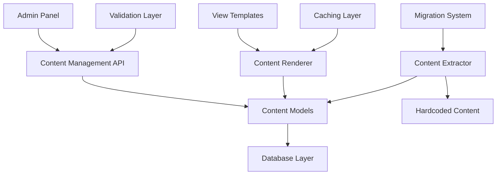

# Design Document: Views Database Conversion

## Overview

Hệ thống hiện tại có 62 files trong app/views/ (48.1% tổng số 129 files) đang hardcode HTML content thay vì sử dụng database. Thiết kế này sẽ chuyển đổi toàn bộ hardcoded content sang database-driven content management system, cho phép quản lý nội dung động thông qua admin panel.

Giải pháp sử dụng các design patterns như Factory Method, Observer, và Composite để tạo ra một hệ thống content management linh hoạt và có thể mở rộng.

## Architecture

### High-Level Architecture



### Content Management Architecture

Hệ thống sử dụng kiến trúc modular với các thành phần chính:

1. **Content Models**: Quản lý các loại nội dung khác nhau
2. **Content Renderer**: Render nội dung từ database ra view
3. **Admin Interface**: Giao diện quản lý nội dung
4. **Migration System**: Chuyển đổi hardcoded content sang database
5. **Validation System**: Đảm bảo tính toàn vẹn dữ liệu

## Components and Interfaces

### 1. Content Models

#### Base Content Model
```php
abstract class BaseContentModel extends BaseModel {
    protected $table = 'contents';
    protected $fillable = [
        'type', 'key', 'title', 'content', 'metadata', 
        'status', 'language', 'version', 'parent_id'
    ];
    
    abstract public function render($context = []);
    abstract public function validate($data);
}
```

#### Specific Content Models
```php
class HomeContentModel extends BaseContentModel {
    public function getHeroSection() { /* Implementation */ }
    public function getProductSlider() { /* Implementation */ }
    public function getCategoryGrid() { /* Implementation */ }
}

class NavigationContentModel extends BaseContentModel {
    public function getMenuItems() { /* Implementation */ }
    public function getBreadcrumbs() { /* Implementation */ }
}

class ProductContentModel extends BaseContentModel {
    public function getRelatedProducts() { /* Implementation */ }
    public function getProductDetails() { /* Implementation */ }
}
```

### 2. Content Factory Pattern

```php
interface ContentFactoryInterface {
    public function createContent($type, $data);
}

class ContentFactory implements ContentFactoryInterface {
    private $contentTypes = [
        'home' => HomeContentModel::class,
        'navigation' => NavigationContentModel::class,
        'product' => ProductContentModel::class,
        'user' => UserContentModel::class,
        'admin' => AdminContentModel::class
    ];
    
    public function createContent($type, $data) {
        if (!isset($this->contentTypes[$type])) {
            throw new InvalidArgumentException("Unknown content type: $type");
        }
        
        $className = $this->contentTypes[$type];
        return new $className($data);
    }
}
```

### 3. Content Renderer

```php
class ContentRenderer {
    private $contentFactory;
    private $cache;
    
    public function __construct(ContentFactoryInterface $factory, CacheInterface $cache) {
        $this->contentFactory = $factory;
        $this->cache = $cache;
    }
    
    public function render($contentKey, $context = []) {
        $cacheKey = "content_{$contentKey}_" . md5(serialize($context));
        
        if ($cached = $this->cache->get($cacheKey)) {
            return $cached;
        }
        
        $content = $this->loadContent($contentKey);
        $rendered = $content->render($context);
        
        $this->cache->set($cacheKey, $rendered, 3600);
        return $rendered;
    }
}
```

### 4. Migration System

```php
class ContentMigrator {
    private $extractor;
    private $contentFactory;
    
    public function migrateFile($filePath) {
        $hardcodedContent = $this->extractor->extractContent($filePath);
        
        foreach ($hardcodedContent as $section) {
            $content = $this->contentFactory->createContent(
                $section['type'], 
                $section['data']
            );
            $content->save();
        }
    }
    
    public function validateMigration($filePath) {
        // Compare original vs database content
        return $this->compareContent($filePath);
    }
}
```

### 5. Admin Interface Components

```php
class ContentController {
    private $contentFactory;
    private $validator;
    
    public function index($type = null) {
        $contents = $this->getContentsByType($type);
        return view('admin.content.index', compact('contents'));
    }
    
    public function edit($id) {
        $content = $this->findContent($id);
        return view('admin.content.edit', compact('content'));
    }
    
    public function update($id, $data) {
        $this->validator->validate($data);
        $content = $this->findContent($id);
        $content->update($data);
        
        // Clear cache
        $this->clearContentCache($content);
        
        return redirect()->back()->with('success', 'Content updated successfully');
    }
}
```

## Data Models

### Content Table Structure

```sql
CREATE TABLE contents (
    id INT PRIMARY KEY AUTO_INCREMENT,
    type VARCHAR(50) NOT NULL,
    key VARCHAR(100) NOT NULL UNIQUE,
    title VARCHAR(255),
    content LONGTEXT,
    metadata JSON,
    status ENUM('draft', 'published', 'archived') DEFAULT 'published',
    language VARCHAR(5) DEFAULT 'vi',
    version INT DEFAULT 1,
    parent_id INT NULL,
    created_at TIMESTAMP DEFAULT CURRENT_TIMESTAMP,
    updated_at TIMESTAMP DEFAULT CURRENT_TIMESTAMP ON UPDATE CURRENT_TIMESTAMP,
    
    INDEX idx_type (type),
    INDEX idx_key (key),
    INDEX idx_status (status),
    INDEX idx_parent (parent_id),
    FOREIGN KEY (parent_id) REFERENCES contents(id) ON DELETE CASCADE
);
```

### Content Types Table

```sql
CREATE TABLE content_types (
    id INT PRIMARY KEY AUTO_INCREMENT,
    name VARCHAR(50) NOT NULL UNIQUE,
    description TEXT,
    schema JSON,
    template VARCHAR(100),
    created_at TIMESTAMP DEFAULT CURRENT_TIMESTAMP
);
```

### Content Versions Table

```sql
CREATE TABLE content_versions (
    id INT PRIMARY KEY AUTO_INCREMENT,
    content_id INT NOT NULL,
    version INT NOT NULL,
    content LONGTEXT,
    metadata JSON,
    created_by INT,
    created_at TIMESTAMP DEFAULT CURRENT_TIMESTAMP,
    
    FOREIGN KEY (content_id) REFERENCES contents(id) ON DELETE CASCADE,
    UNIQUE KEY unique_version (content_id, version)
);
```

### Sample Data Structure

```json
{
  "home_hero": {
    "type": "home",
    "key": "hero_section",
    "title": "Hero Section",
    "content": {
      "heading": "Nền tảng data nguồn hàng và dịch vụ",
      "subheading": "Thương mại xuyên biên giới",
      "description": "ThuongLo là nền tảng hàng đầu...",
      "buttons": [
        {"text": "Đăng ký miễn phí", "url": "?page=register", "type": "primary"},
        {"text": "Xem sản phẩm", "url": "?page=products", "type": "secondary"}
      ],
      "image": {
        "src": "home/home-banner-final.png",
        "alt": "ThuongLo - Nền tảng thương mại xuyên biên giới"
      }
    }
  }
}
```

## Correctness Properties

*A property is a characteristic or behavior that should hold true across all valid executions of a system-essentially, a formal statement about what the system should do. Properties serve as the bridge between human-readable specifications and machine-verifiable correctness guarantees.*

### Property 1: Content Migration Round Trip Integrity
*For any* hardcoded content file, migrating to database then validating should confirm that all original content is preserved with identical structure, formatting, and no data loss or corruption
**Validates: Requirements 1.2, 1.5, 7.1**

### Property 2: Content Rendering Consistency  
*For any* content retrieved from database, rendering should produce identical HTML output and visual appearance compared to the original hardcoded version
**Validates: Requirements 7.3**

### Property 3: Content CRUD Operations Completeness
*For any* content type (home, user, admin, events, news), all create, read, update, and delete operations through admin panel should work correctly and maintain data integrity
**Validates: Requirements 2.2, 3.2, 4.2, 5.2**

### Property 4: Content Validation and Link Integrity
*For any* content data submitted, validation should reject invalid data, verify all URLs and references are working, and accept only properly formatted content according to the defined schema
**Validates: Requirements 2.4, 7.2**

### Property 5: Real-time Content Updates
*For any* content modification, changes should be immediately reflected on the website and all related cached content should be invalidated and regenerated
**Validates: Requirements 2.3**

### Property 6: Content Hierarchy and Relationships Preservation
*For any* nested content structure or product relationships, the parent-child relationships should be maintained correctly in database, support both automatic generation and manual override
**Validates: Requirements 1.4, 6.2, 6.3, 6.4**

### Property 7: Multi-language Content Support
*For any* content with language variants, switching languages should display the correct localized version without affecting other language content
**Validates: Requirements 3.4**

### Property 8: Content Version History and Rollback
*For any* content modification, the system should maintain complete version history allowing rollback to any previous state with identical content
**Validates: Requirements 8.4**

### Property 9: Content Search and Filter Accuracy
*For any* search query in admin panel, results should include all matching content and exclude non-matching content based on the search criteria, providing efficient filtering capabilities
**Validates: Requirements 8.5**

### Property 10: Comprehensive Content Migration Coverage
*For any* specified file pattern (users/*, admin/*, events/*, news/*, _layout/*), all hardcoded content should be identified and migrated to appropriate database tables
**Validates: Requirements 1.1, 3.1, 4.1, 5.1, 6.1**

### Property 11: Role-based Content Access Control
*For any* user with specific role permissions, they should only see and be able to modify content appropriate to their access level
**Validates: Requirements 5.4**

### Property 12: Rich Content and Media Support
*For any* content with rich text, media attachments, or advanced formatting, the system should preserve all formatting and media references correctly
**Validates: Requirements 4.3, 8.2, 8.3**

## Error Handling

### Content Loading Errors
- **Missing Content**: Return default content or placeholder
- **Invalid Content**: Log error and return fallback content
- **Database Connection**: Use cached content if available

### Migration Errors
- **File Not Found**: Skip and log error
- **Parse Errors**: Manual review required
- **Duplicate Content**: Merge or version control

### Admin Interface Errors
- **Validation Failures**: Display user-friendly error messages
- **Permission Errors**: Redirect to appropriate page
- **Save Failures**: Preserve user input and show retry option

### Cache Errors
- **Cache Miss**: Regenerate content from database
- **Cache Corruption**: Clear and rebuild cache
- **Cache Server Down**: Operate without cache temporarily

## Testing Strategy

### Unit Testing
- Test individual content models and their methods
- Test content factory creation logic
- Test validation rules for each content type
- Test cache operations and invalidation
- Test migration extraction and conversion logic

### Property-Based Testing
- **Minimum 100 iterations per property test**
- Each property test references its design document property
- Tag format: **Feature: views-database-conversion, Property {number}: {property_text}**

**Property Test Examples:**
```php
// Property 1: Content Migration Integrity
public function testContentMigrationIntegrity() {
    // Generate random hardcoded content
    // Migrate to database
    // Validate all content preserved
}

// Property 2: Content Rendering Consistency
public function testContentRenderingConsistency() {
    // Generate random content data
    // Render from database
    // Compare with expected output
}
```

### Integration Testing
- Test complete migration workflow for sample files
- Test admin interface CRUD operations
- Test content rendering in actual view templates
- Test cache integration with content updates
- Test multi-language content switching

### End-to-End Testing
- Test complete user journey from hardcoded to database-driven content
- Test admin content management workflows
- Test website functionality after migration
- Test performance with large content datasets