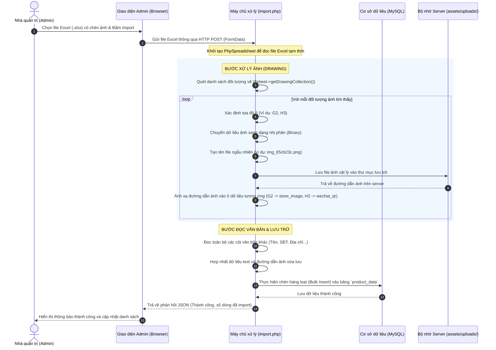

# TÀI LIỆU KỸ THUẬT: GIẢI PHÁP IMPORT DỮ LIỆU SẢN PHẨM TỪ EXCEL CHỨA HÌNH ẢNH (PHƯƠNG ÁN 2)

Tài liệu này mô tả chi tiết giải pháp kỹ thuật, luồng xử lý và phương án triển khai nâng cấp chức năng import dữ liệu sản phẩm từ file Excel (`.xlsx`) chứa hình ảnh được chèn trực tiếp từ máy tính (lớp vẽ nổi - Drawing Layer) vào hệ thống **ThuongLo Website**.

---

## 1. Tổng Quan Giải Pháp

Hiện tại, hệ thống sử dụng thư viện **PhpSpreadsheet** để đọc dữ liệu từ file Excel tải lên. Tuy nhiên, hàm đọc mặc định chỉ quét dữ liệu dạng văn bản (text/number) chứa trong các ô, trong khi hình ảnh chèn trực tiếp từ máy tính vào Excel được lưu trữ ở một lớp đồ họa độc lập (Drawing Layer).

**Giải pháp (Phương án 2):** Nâng cấp mã nguồn PHP xử lý import để quét lớp Drawing Layer này, trích xuất dữ liệu ảnh nhị phân, tự động lưu thành file vật lý trên server và ghi nhận đường dẫn tương ứng vào Database.

---

## 2. Luồng Hoạt Động Chi Tiết (Workflow)

Dưới đây là sơ đồ tuần tự thể hiện cách hệ thống xử lý khi Admin thực hiện tải lên một file Excel có chứa văn bản và hình ảnh chèn trực tiếp:



---

## 3. Thiết Kế Kỹ Thuật & Giải Thuật Trích Xuất Ảnh

Trong file xử lý PHP, chúng ta sẽ áp dụng thuật toán duyệt Drawings của PhpSpreadsheet để trích xuất ảnh.

### 3.1. Các bước tiền xử lý ảnh trong PHP

Khi đọc file Excel, ta thực hiện các bước lập trình như sau:

1. **Khởi tạo và tải Spreadsheet:**
   ```php
   $spreadsheet = \PhpOffice\PhpSpreadsheet\IOFactory::load($filePath);
   $sheet = $spreadsheet->getActiveSheet();
   ```

2. **Duyệt danh sách các Drawing:**
   ```php
   $drawings = $sheet->getDrawingCollection();
   $extractedImages = []; // Mảng lưu trữ ảnh tạm thời theo tọa độ ô [Tọa_độ => Đường_dẫn_file]
   
   foreach ($drawings as $drawing) {
       // Xác định tọa độ ô chứa ảnh (ví dụ: "G2")
       $coordinates = $drawing->getCoordinates(); 
       
       // Đọc dữ liệu ảnh vật lý
       if ($drawing instanceof \PhpOffice\PhpSpreadsheet\Worksheet\Drawing) {
           $filename = $drawing->getPath();
           $imageContent = file_get_contents($filename);
           $extension = $drawing->getExtension();
       } elseif ($drawing instanceof \PhpOffice\PhpSpreadsheet\Worksheet\MemoryDrawing) {
           ob_start();
           call_user_func($drawing->getRenderingFunction(), $drawing->getImageResource());
           $imageContent = ob_get_contents();
           ob_end_clean();
           $extension = 'png'; // Mặc định png cho ảnh kết xuất từ bộ nhớ
       }
       
       // Lưu ảnh lên máy chủ
       $uploadDir = __DIR__ . '/../../../../assets/uploads/product_data/';
       if (!is_dir($uploadDir)) {
           mkdir($uploadDir, 0755, true);
       }
       
       $newFileName = 'imported_' . uniqid() . '_' . time() . '.' . $extension;
       $savePath = $uploadDir . $newFileName;
       
       if (file_put_contents($savePath, $imageContent)) {
           // Lưu đường dẫn tương đối để ghi vào Database
           $extractedImages[$coordinates] = 'assets/uploads/product_data/' . $newFileName;
       }
   }
   ```

3. **Ánh xạ tọa độ ảnh vào mảng dữ liệu dòng tương ứng:**
   Khi duyệt qua các hàng (`$rows = $sheet->toArray()`), ta xác định tên cột dựa trên chỉ số index.
   *   Nếu ô thuộc cột **G** (Ảnh cửa hàng): Kiểm tra xem `$extractedImages["G" . $rowNumber]` có tồn tại đường dẫn ảnh đã lưu hay không. Nếu có, gán giá trị đó vào trường `store_image`.
   *   Nếu ô thuộc cột **H** (QR WeChat): Kiểm tra xem `$extractedImages["H" . $rowNumber]` có tồn tại đường dẫn hay không. Nếu có, gán vào trường `wechat_qr`.

---

## 4. Thay Đổi Cấu Trúc Mã Nguồn & Thư Mục

Để triển khai giải pháp này, chúng ta cần cập nhật các thành phần sau:

### 4.1. File `app/views/admin/products/data/import.php`
*   **Hàm `parseXLSX`:** Cần được viết lại để vừa đọc dữ liệu text vừa thực hiện trích xuất Drawings (như giải thuật ở mục 3).
*   **Hàm `transformDataForImport`:** Bổ dung ánh xạ khóa `'store_image'` vào mảng dữ liệu ghi xuống database (hiện tại code đang bỏ quên trường này).

### 4.2. Thư mục lưu trữ hình ảnh
*   Tạo thư mục mới tại đường dẫn: `assets/uploads/product_data/`
*   Đảm bảo thư mục này có quyền ghi (chế độ ghi cho ứng dụng web - Permission `0755` hoặc `0777` trên server Windows/Linux).

---

## 5. Quy Chuẩn File Excel Mẫu Cho Admin

Để giải thuật trích xuất tọa độ hoạt động chính xác 100%, file Excel tải lên cần tuân thủ một số quy tắc đơn giản sau:

| STT | Tên nhà cung cấp | Địa chỉ | WeChat | Điện thoại | Phân loại phong cách | Ảnh cửa hàng | QR WeChat |
| :--- | :--- | :--- | :--- | :--- | :--- | :--- | :--- |
| *Cột A* | *Cột B* | *Cột C* | *Cột D* | *Cột E* | *Cột F* | *Cột G* | *Cột H* |
| Tên NCC 1 | Hà Nội | wechat_id_1 | 0987654321 | Hiện đại | *(Chèn ảnh)* | *(Chèn ảnh)* |

> [!IMPORTANT]
> **Quy tắc chèn ảnh trong Excel:**
> 1. **Ảnh phải nằm gọn trong ô:** Khi chèn ảnh vào cột G (Ảnh cửa hàng) hoặc H (QR WeChat), Admin cần căn chỉnh kích thước của ảnh sao cho các cạnh của ảnh nằm hoàn toàn bên trong ranh giới ô của dòng đó. Nếu ảnh bị tràn sang ô khác, thư viện có thể nhận diện sai tọa độ dòng (ví dụ: ảnh dòng 2 bị tràn xuống dòng 3 sẽ bị import vào dữ liệu dòng 3).
> 2. **Định dạng file chấp nhận:** Hệ thống sẽ hỗ trợ tự động chuyển đổi các định dạng ảnh phổ biến bao gồm `.png`, `.jpg`, `.jpeg`, `.gif`.

---

## 6. Đánh Giá Ưu & Nhược Điểm

### Ưu điểm
*   **Tiết kiệm thời gian:** Admin không cần mất công tải ảnh lên host trung gian để lấy link, rồi lại copy-paste link vào Excel. Chỉ cần kéo thả ảnh vào Excel là xong.
*   **Trực quan:** File Excel quản lý dữ liệu hiển thị hình ảnh trực quan giúp Admin dễ kiểm tra chéo thông tin trước khi import.

### Nhược điểm & Hướng khắc phục
*   **Dung lượng file lớn:** File Excel chứa hàng trăm ảnh gốc (độ phân giải cao) từ điện thoại có thể lên tới vài chục MB, dễ gây quá tải bộ nhớ máy chủ (PHP Memory Limit) hoặc lỗi hết thời gian chờ (Timeout) khi tải lên.
    *   *Hướng khắc phục:* 
        1. Khuyến nghị Admin nén/giảm dung lượng ảnh trước khi chèn vào Excel.
        2. Tăng cấu hình giới hạn dung lượng tải lên và thời gian thực thi của PHP (`upload_max_filesize`, `post_max_size`, `max_execution_time`) trên máy chủ phù hợp với nhu cầu vận hành.
