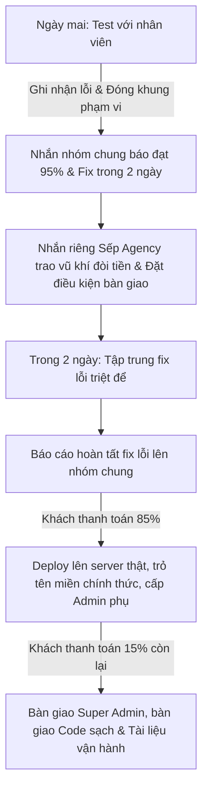

# KỊCH BẢN CHI TIẾT: NGHIỆM THU KỸ THUẬT & ĐÒI DÒNG TIỀN DỰ ÁN
## HỆ THỐNG WEBSITE THƯƠNG LỘ (THUONGLO.COM)
*Dành cho Freelancer dưới danh nghĩa nhân viên Agency | Phiên bản thực chiến 2026*

---

> [!IMPORTANT]
> **4 NGUYÊN TẮC VÀNG TRONG CHIẾN DỊCH ĐÒI TIỀN LẦN NÀY:**
> 1. **Đóng khung lỗi:** Không cho khách phát sinh yêu cầu mới ngoài 65 hạng mục đã chốt.
> 2. **Dùng "Bằng chứng vàng":** Khách đang đăng sản phẩm bán hàng ầm ầm tức là sản phẩm đã mang lại giá trị thực tế -> Họ bắt buộc phải trả tiền.
> 3. **Trao vũ khí cho Sếp:** Sếp Agency ngại đòi tiền vì sợ khách chê web lỗi. Bạn đưa báo cáo test sạch sẽ -> Sếp tự tin 100% để xuất hóa đơn đòi tiền.
> 4. **Giữ chắc đằng chuôi:** Tuyệt đối không bàn giao code và quyền quản trị tối cao (Super Admin) khi tiền chưa nổi trong tài khoản của bạn.

---

## 🎯 GIAI ĐOẠN 1: KỊCH BẢN DẪN DẮT BUỔI TEST VỚI NHÂN VIÊN CỦA KHÁCH (NGÀY MAI)

Mục tiêu của ngày mai là làm cho nhân viên của khách cảm thấy thoải mái, tôn trọng bạn, và cùng bạn ký xác nhận vào biên bản test với kết quả tốt nhất.

### 1. Cách ứng xử & Tâm lý chiến:
* **Thái độ:** Hợp tác, lắng nghe, coi nhân viên của khách là "đồng minh" cùng hoàn thiện sản phẩm chứ không phải đối thủ đi soi lỗi.
* **Nguyên tắc xử lý khi phát hiện lỗi:** 
  * Tuyệt đối không cãi, không giải thích vòng vo bào chữa.
  * Hãy nói: *"Lỗi này em ghi nhận, lỗi này chỉnh lại CSS/Logic nhỏ thôi, em sẽ fix xong ngay trong chiều mai."*

### 2. Lời thoại chốt hạ buổi test với Nhân viên (Khi test xong):
> *"OK [Tên Nhân Viên], vậy là hai đứa mình đã đi qua toàn bộ 65 hạng mục chức năng của web rồi nhé. Chạy rất mượt và chuẩn chỉnh, chỉ còn đúng [Số lỗi] lỗi nhỏ này em ghi nhận lại ở bảng Bug Report này.*
> 
> *Tất cả các phần nâng cấp thêm như CMS sửa banner và danh mục đa cấp anh/chị cũng đã test và hoạt động tốt rồi đúng không? Lát nữa mình gửi file chốt kết quả test này vào nhóm chung để sếp em và sếp bên [Tên Khách Hàng] nắm được tiến độ nhé. Em sẽ tập trung fix xong [Số lỗi] lỗi này trong 1-2 ngày tới để bên mình chính thức nghiệm thu bàn giao luôn nha."*

---

## 🎯 GIAI ĐOẠN 2: KỊCH BẢN TRUYỀN THÔNG NHÓM CHUNG (NGAY SAU BUỔI TEST)

Sau khi test xong, bạn lập tức gửi tin nhắn này vào nhóm chat chung (nơi có mặt Khách hàng lớn, Sếp Agency, bạn và các nhân viên). **Đính kèm hình ảnh bảng kết quả test hoặc file PDF kiểm thử.**

### Mẫu tin nhắn gửi nhóm chung:
```text
Dạ em chào anh/chị [Tên Khách Hàng Lớn] và anh [Tên Sếp Agency],

Chiều nay em và bạn [Tên Nhân Viên của khách] đã tiến hành kiểm thử kỹ thuật chi tiết toàn bộ hệ thống website ThuongLo.com theo checklist 65 hạng mục (bao gồm đầy đủ các tính năng trong hợp đồng gốc, cổng thanh toán tự động SePay, cùng các phần nâng cấp CMS nội dung và danh mục đa cấp).

Kết quả kiểm thử thực tế cực kỳ khả quan:
- Tổng số hạng mục kiểm thử: 65
- Đã hoàn thành và hoạt động tốt (OK): 61/65 hạng mục (Đạt 94% tiến độ dự án).
- Hạng mục cần tinh chỉnh lại (BUG): Chỉ còn 4 lỗi nhỏ liên quan đến giao diện (em đã ghi nhận chi tiết tại bảng Bug Report đính kèm bên dưới).

Hiện tại hệ thống đã chạy rất ổn định, phía bên mình cũng đã đăng tải sản phẩm và chỉnh sửa nội dung chạy thực tế hàng ngày rồi ạ. 

Em sẽ tập trung khắc phục triệt để 4 lỗi nhỏ này ngay trong ngày mai và ngày kia (hoàn thành trước ngày [Ngày/Tháng]). Sau khi em báo cáo hoàn tất sửa lỗi vào nhóm, em xin phép nhờ anh/chị [Tên Khách Hàng Lớn] duyệt nghiệm thu kỹ thuật chính thức để bên em chuẩn bị các thủ tục chuyển giao mã nguồn và quyền vận hành hệ thống ạ!

Em cảm ơn anh/chị!
```

---

## 🎯 GIAI ĐOẠN 3: KỊCH BẢN RIÊNG ĐÒI DÒNG TIỀN VỚI SẾP AGENCY (SAU KHI NHẮN NHÓM CHUNG)

Đây là bước then chốt để giải quyết vấn đề "Sếp Agency ngại đòi tiền". Bạn phải gửi tin nhắn này **ngay sau khi gửi tin nhắn nhóm chung** để Sếp Agency nắm được thế chủ động.

### Mẫu tin nhắn riêng gửi Sếp Agency:
```text
Anh [Tên Sếp] ơi, kết quả test chi tiết chiều nay với nhân viên bên khách em đã gửi lên nhóm chung rồi anh nhé. Web chạy rất mượt, các tính năng cốt lõi đến tính năng phát sinh PayOS/CMS họ đều ưng ý và xác nhận hết rồi, chỉ còn 4 lỗi giao diện lặt vặt em xử lý xong ngay trong 1-2 ngày tới thôi ạ.

Hiện tại khách đã đăng tải sản phẩm kinh doanh ầm ầm trên web rồi, cộng với việc nhân viên của họ đã xác nhận đạt 94% checklist kỹ thuật hôm nay. Như vậy là bên mình hoàn toàn có đầy đủ cơ sở pháp lý và lý lẽ vững chắc để yêu cầu khách giải ngân dòng tiền đợt tiếp theo (85% hoặc theo các giai đoạn đã dồn lại) rồi anh ạ.

Anh phát hành đề nghị thanh toán (Invoice) gửi sang cho bên khách đòi tiền giúp em đợt này nhé. Em đã chuẩn bị sẵn mọi thứ rất sạch sẽ để anh làm việc với họ rồi, mình không có gì phải ngại cả vì sản phẩm mình làm quá tốt và họ đang thực tế sử dụng rồi.

Anh nhắn sớm với khách giúp em nha, vì sau khi em báo fix xong các lỗi nhỏ vào ngày kia, em sẽ đợi anh xác nhận dòng tiền đợt này về từ khách để tiến hành đóng gói chuyển giao mã nguồn, cấu hình chạy tên miền chính thức trỏ về hosting thật của họ luôn ạ!
```

### 🚨 Cách xử lý các tình huống Sếp Agency thoái thác:
* **Tình huống A (Sếp bảo: "Để khách test xong hết, nghiệm thu hẳn rồi đòi một thể"):**
  * *Bạn đáp:* `"Anh ơi, dự án này đã kéo dài rất lâu do ban đầu mình làm chậm và em đã dồn toàn bộ nguồn lực, thậm chí làm thêm không công cả phần CMS lẫn danh mục đa cấp để cứu tiến độ cho bên mình. Khách họ đã dùng web để up sản phẩm bán thật rồi, tức là họ đã khai thác thương mại sản phẩm của mình. Nếu đợi nghiệm thu bàn giao xong xuôi hết mới đòi tiền thì bên mình rất mất thế chủ động và em cũng đang kẹt dòng tiền nghiêm trọng. Anh hỗ trợ đòi đợt này giúp em để em hoàn tất bàn giao nhé."`
* **Tình huống B (Sếp im lặng hoặc né tránh):**
  * Cứ tập trung fix nốt lỗi trong 1-2 ngày, nhưng **giữ trạng thái lấp lửng về tiến trình deploy tên miền thật**. Nói khéo là đang đợi dòng tiền khớp để kích hoạt key API hoặc cấu hình hệ thống.

---

## 🎯 GIAI ĐOẠN 4: CHIẾN THUẬT BÀN GIAO KỸ THUẬT (GIỮ CHẮC ĐẰNG CHUÔI)

Sau 1-2 ngày, khi bạn đã fix xong hoàn toàn các lỗi trong danh sách Bug Report.

### 1. Nhắn báo cáo hoàn tất vào Nhóm Chung:
> *"Dạ em báo cáo anh/chị [Tên Khách Hàng Lớn] và anh [Tên Sếp], toàn bộ 4 lỗi nhỏ phát sinh trong buổi test hôm trước em đã khắc phục xong hoàn toàn và kiểm tra kỹ lưỡng trên cả máy tính lẫn điện thoại rồi ạ.*
> 
> *Hệ thống website ThuongLo.com hiện tại đã đạt trạng thái hoàn hảo 100% chức năng và sẵn sàng đi vào vận hành chính thức trên tên miền thật. Em gửi thông tin để anh/chị nắm được tiến độ ạ!"*

### 2. Nguyên tắc bàn giao "Bất di bất dịch" để bảo vệ tiền của bạn:
Khi khách hàng hoặc Agency hối thúc bạn chuyển web sang server của khách và cấu hình tên miền chính thức:

* **Tuyệt đối KHÔNG giao tài khoản Super Admin (quyền tối cao):** Chỉ tạo cho họ một tài khoản Admin phụ (`Administrator` nhưng bị giới hạn quyền truy cập cấu hình hệ thống nhạy cảm hoặc database) với lý do: *"Để đảm bảo an toàn hệ thống trong quá trình bàn giao vận hành thử, bên em cấp quyền admin vận hành trước để anh/chị đăng sản phẩm."*
* **Tuyệt đối KHÔNG bàn giao thông tin hosting/database/cpanel:** Mọi thứ vẫn để chạy trên staging của bạn hoặc của Agency mà bạn quản lý.
* **Tuyệt đối KHÔNG gửi source code (.zip) hoặc cơ sở dữ liệu (.sql) cho khách hoặc sếp:** Cho đến khi tiền đợt 85% nổi trong tài khoản của bạn.
* **Cách trả lời khéo léo khi bị hối thúc bàn giao code trước khi trả tiền:**
  > *"Dạ anh/chị ơi, theo đúng quy trình bàn giao của công ty bên em, sau khi hệ thống hoàn tất 100% kỹ thuật, kế toán bên em cần xác nhận hoàn thành nghĩa vụ thanh toán đợt nghiệm thu kỹ thuật (đợt 85%) để kích hoạt hệ thống bàn giao code và chuyển giao hosting chính thức. Ngay khi kế toán bên em báo dòng tiền đợt này đã khớp, em sẽ lập tức deploy hệ thống lên server thật của anh/chị chỉ trong vòng 30 phút là chạy tên miền chính thức ngay ạ!"*

---

## 📝 TỔNG KẾT TIẾN TRÌNH THỰC HIỆN CỦA BẠN:



Áp dụng đúng kịch bản này sẽ giúp bạn giữ được sự chuyên nghiệp tuyệt đối trong mắt khách hàng, tạo động lực cực lớn cho sếp Agency hành động, và quan trọng nhất là bảo vệ được trọn vẹn số tiền công sức mà bạn đã bỏ ra!
