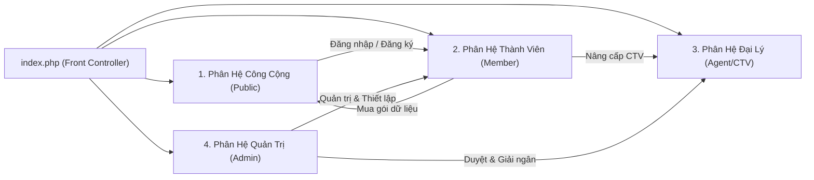
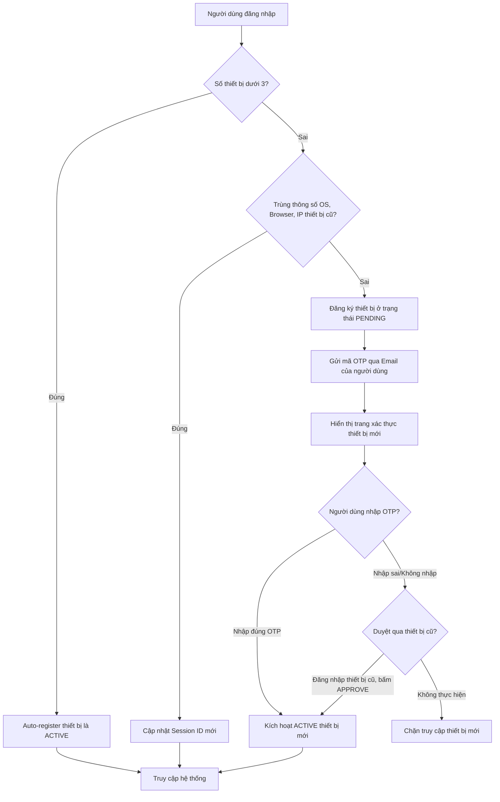
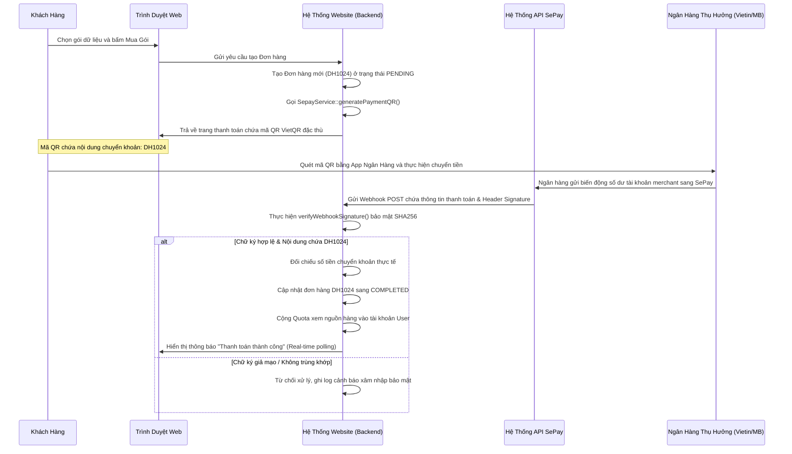
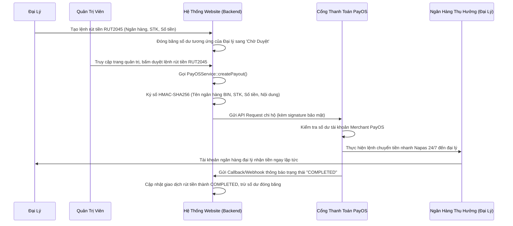

# TÀI LIỆU PHÂN TÍCH NGHIỆP VỤ & HƯỚNG DẪN VẬN HÀNH HỆ THỐNG

---

## MỤC LỤC

1. **Kiến Trúc Hệ Thống & Sitemap**
   - 1.1. Bản Đồ Sitemap Toàn Diện
   - 1.2. Luồng Điều Hướng Người Dùng (User Navigation Flow)
2. **Ma Trận Phân Quyền & Chi Tiết 4 Vai Trò (Roles & Permissions)**
   - 2.1. Khách Vãng Lai (Guest - Người dùng chưa đăng nhập)
   - 2.2. Thành Viên Hệ Thống (Registered User - Người dùng đã có tài khoản)
   - 2.3. Cộng Tác Viên / Đại Lý (Agent / CTV)
   - 2.4. Quản Trị Viên (Admin)
3. **Quy Trình Nghiệp Vụ Đặc Thù & Cơ Chế Hoạt Động Ngầm**
   - 3.1. Xác Thực Đa Thiết Bị (Multi-Device Authentication & Security)
   - 3.2. Cổng Thu Hộ Tự Động SePay (Auto Payment Collection)
   - 3.3. Cổng Chi Hộ Tự Động PayOS (Automated Affiliate Payout)
   - 3.4. Cơ Chế Chống Bán Lại & Bảo Vệ Dữ Liệu Nguồn Hàng (Anti-Resale & Copy Hardening)

---

## 1. KIẾN TRÚC HỆ THỐNG & SITEMAP

Hệ thống được phát triển trên kiến trúc MVC tự xây dựng (Custom Lightweight MVC Framework) sử dụng cơ chế **Front Controller** qua tập tin `index.php`. Tất cả các yêu cầu từ máy khách (client request) đều được định tuyến thông qua tham số `$_GET['page']` và `$_GET['action']` trước khi được bộ định tuyến phân tích và ánh xạ sang các Controller và View tương ứng.

### 1.1. Bản Đồ Sitemap Toàn Diện

Dưới đây là sơ đồ kiến trúc các trang (Sitemap) phân chia theo nhóm đối tượng truy cập và các luồng chức năng:

Để đảm bảo tính trực quan và dễ theo dõi nhất, kiến trúc Sitemap được tách bạch thành 2 phần: **Sơ đồ Khối Quan hệ Cấp cao** (chỉ hiển thị cách các phân hệ tương tác với nhau) và **Bản đồ Cấu trúc Cây chi tiết** từng trang/đường dẫn.

#### Sơ Đồ Khối Quan Hệ Cấp Cao:



#### Bản Đồ Cấu Trúc Cây Chi Tiết (Sitemap Tree):

```text
thuonglo.com (index.php)
├──  PHÂN HỆ CÔNG CỘNG (GUEST / PUBLIC AREA)
│   ├──  Trang Chủ (?page=home)
│   ├──  Danh Sách Gói Nguồn Hàng (?page=products)
│   ├──  Chi Tiết Gói Nguồn Hàng (?page=details&id=...)
│   ├──  Tin Tức & Blog (?page=news)
│   ├──  Hỏi Đáp / Hỗ Trợ (?page=faq)
│   └──  Cổng Xác Thực (?page=auth)
│       ├──  Đăng Nhập (auth/login.php)
│       ├──  Đăng Ký (auth/register.php)
│       └──  Quên Mật Khẩu (auth/forgot.php)
│
├──  PHÂN HỆ THÀNH VIÊN (REGISTERED USER AREA)
│   ├──  Dashboard Thành Viên (?page=users&module=dashboard)
│   ├──  Thiết Lập Hồ Sơ (?page=users&module=profile)
│   ├──  Lịch Sử Đơn Hàng (?page=users&module=orders)
│   ├──  Quản Lý Thiết Bị (?page=users&module=access)
│   ├──  Trang Thanh Toán (?page=checkout)
│   ├──  Quét Mã QR VietQR (?page=payment)
│   └──  Xem Dữ Liệu Nguồn Hàng (?page=product-data&id=...) - [Áp dụng bảo mật cứng]
│
├──  PHÂN HỆ ĐẠI LÝ / CTV (AFFILIATE AREA)
│   ├──  Đăng Ký Đại Lý (?page=agent&action=register)
│   ├──  Trang Chờ Xét Duyệt (?page=agent&action=processing)
│   ├──  Dashboard Đại Lý (?page=agent&action=dashboard)
│   ├──  Tài Nguyên Tiếp Thị (?page=agent&action=marketing) - [Link & QR Code Giới Thiệu]
│   ├──  Quản Lý Tài Chính (?page=agent&action=finance) - [Yêu Cầu Rút Tiền]
│   ├──  Danh Sách Khách Hàng (?page=agent&action=customers)
│   └──  Lịch Sử Hoa Hồng (?page=agent&action=commissions)
│
└──  PHÂN HỆ QUẢN TRỊ (ADMIN AREA)
    ├──  Dashboard Tổng Quan (/admin/dashboard.php)
    ├──  Quản Lý Sản Phẩm (/admin/products/index.php)
    │   ├──  Thêm Sản Phẩm Mới (add.php)
    │   ├──  Import Excel Nguồn Hàng (data/import.php)
    │   └──  Cấu Hình Bộ Lọc (filter_config.php)
    ├──  Quản Lý Đơn Hàng (/admin/orders/)
    ├──  Quản Lý CTV & Đại Lý (/admin/affiliates/index.php)
    │   ├──  Duyệt Đăng Ký Đại Lý (requests.php)
    │   └──  Duyệt Chi Hộ PayOS Tự Động (withdrawals.php)
    └──  Cài Đặt Hệ Thống (/admin/settings/)
```

### 1.2. Luồng Điều Hướng Người Dùng (User Navigation Flow)

Hệ thống quản lý việc điều hướng của người dùng một cách chặt chẽ qua cơ chế kiểm tra Session trạng thái:

1. **Luồng Mua Gói & Xem Dữ Liệu**:
   `Khách vãng lai` $\rightarrow$ Xem sản phẩm $\rightarrow$ Bấm Mua hàng $\rightarrow$ Yêu cầu Đăng nhập/Đăng ký $\rightarrow$ Tới trang Thanh toán $\rightarrow$ Sinh mã QR chuyển khoản $\rightarrow$ Khách quét mã $\rightarrow$ SePay kích hoạt webhook tự động $\rightarrow$ Đơn hàng hoàn thành $\rightarrow$ Hệ thống trừ quota và cấp Token bảo mật $\rightarrow$ Người dùng chuyển đến trang `data_list.php` để xem dữ liệu nguồn hàng đã mua dưới các lớp bảo mật bảo vệ thông tin.
2. **Luồng Tiếp Thị Liên Kết (Affiliate)**:
   `Người dùng mới` truy cập qua Link giới thiệu dạng `https://thuonglo.com?ref=AGENT_CODE` $\rightarrow$ Session lưu trữ cookie `ref_code` $\rightarrow$ Khách đăng ký tài khoản $\rightarrow$ Hệ thống ghi nhận khách hàng này thuộc về `Agent` giới thiệu $\rightarrow$ Khách hàng phát sinh đơn mua gói dữ liệu $\rightarrow$ Hệ thống tự động trích hoa hồng (10% - 20%) cộng vào số dư chờ duyệt (`pending_commission`) của Agent.

---

## 2. MA TRẬN PHÂN QUYỀN & CHI TIẾT 4 VAI TRÒ (ROLES & PERMISSIONS)

| Quyền hạn & Tính năng                                  |  Khách Vãng Lai (Guest)  |         Thành Viên (User)         |          Đại Lý (Agent)          |   Quản Trị Viên (Admin)   |
| :--------------------------------------------------------- | :-------------------------: | :----------------------------------: | :----------------------------------: | :--------------------------: |
| **Xem Landing Page, Tin Tức, FAQ**                  |         Đầy đủ         |              Đầy đủ              |              Đầy đủ              |          Đầy đủ          |
| **Xem Danh Sách & Mô Tả Gói Nguồn Hàng**       |     Đầy đủ (Public)     |              Đầy đủ              |              Đầy đủ              |          Đầy đủ          |
| **Đăng Ký Tài Khoản Mới**                      |         Đầy đủ         |             Không cần             |             Không cần             |         Không cần         |
| **Đặt Mua Gói Dữ Liệu & Thanh Toán QR**        | Chỉ xem (yêu cầu Login) |              Đầy đủ              |              Đầy đủ              |         Không cần         |
| **Xem Dữ Liệu Nguồn Hàng Nhạy Cảm**            | Bị chặn (chuyển hướng) | Chỉ gói đã mua (yêu cầu Token) | Chỉ gói đã mua (yêu cầu Token) |    Đầy đủ quyền xem    |
| **Đăng Ký Nâng Cấp CTV / Đại Lý**            |          Bị chặn          |              Đầy đủ              |            Đã là Agent            |         Không cần         |
| **Lấy Link Tiếp Thị & Mã QR Giới Thiệu**       |          Bị chặn          |              Bị chặn              |              Đầy đủ              |          Đầy đủ          |
| **Yêu Cầu Rút Tiền Hoa Hồng (PayOS)**           |          Bị chặn          |              Bị chặn              |     Đầy đủ (khi có số dư)     |        Duyệt chi hộ        |
| **Quản Lý Sản Phẩm, Import Excel Dữ Liệu**     |          Bị chặn          |              Bị chặn              |              Bị chặn              | Đầy đủ quyền quản trị |
| **Duyệt Đơn Hàng, Duyệt Đại Lý, Duyệt Chi** |          Bị chặn          |              Bị chặn              |              Bị chặn              | Đầy đủ quyền quản trị |

---

### 2.1. Khách Vãng Lai (Guest - Người dùng chưa đăng nhập)

* **Định nghĩa**: Người dùng vãng lai chưa có tài khoản hoặc chưa thực hiện đăng nhập vào hệ thống.
* **Phân tích quyền hạn**: Đây là vai trò có mức độ tiếp cận dữ liệu thấp nhất. Chỉ được phép đọc các nội dung mang tính giới thiệu, danh sách sản phẩm ở dạng khái quát và các bài viết tin tức công cộng. Mọi thao tác truy xuất dữ liệu nhạy cảm hoặc tạo đơn hàng đều bị hệ thống chặn ở tầng Controller.
* **Các chức năng và thao tác chi tiết**:
  1. **Xem Trang Chủ & Bài Viết Tin Tức**: Truy cập trang chủ `./` hoặc `?page=news`. Người dùng có thể đọc các bài viết chia sẻ kinh nghiệm nhập hàng, hướng dẫn kinh doanh.
  2. **Xem Danh Sách Gói Nguồn Hàng**: Truy cập `?page=products`. Giao diện hiển thị danh sách các lĩnh vực nguồn hàng (Ví dụ: Thời trang Quảng Châu, Phụ kiện, Gia dụng thông minh...).
  3. **Xem Chi Tiết Mô Tả Sản Phẩm**: Truy cập `?page=details&id=[ID_SẢN_PHẨM]`. Khách vãng lai chỉ nhìn thấy tiêu đề gói, bài viết mô tả chi tiết, số lượng dòng dữ liệu, số lượt mua, giá tiền và nút **"Đăng nhập để mua ngay"**.
  4. **Đăng Ký / Đăng Nhập Tài Khoản**: Click nút **"Đăng nhập"** hoặc **"Đăng ký"** tại Header để điều hướng sang biểu mẫu tương ứng.

---

### 2.2. Thành Viên Hệ Thống (Registered User - Người dùng đã có tài khoản)

* **Định nghĩa**: Người dùng đã hoàn tất đăng ký tài khoản qua form xác thực của website.
* **Phân tích quyền hạn**: Có toàn quyền quản trị tài khoản cá nhân, đặt mua các gói dữ liệu nguồn hàng, thanh toán qua SePay và xem các nguồn hàng đã mua trong thời hạn được cấp Token.
* **Quy trình đăng ký tài khoản (Trở thành User)**:
  1. **Bấm Nút**: Tại trang chủ, click nút **"Đăng ký"** ở góc phải Header (hoặc truy cập trực tiếp `?page=register`).
  2. **Nhập Thông Tin**: Khách nhập các trường: *Họ và tên đầy đủ*, *Email liên hệ*, *Số điện thoại*, *Mật khẩu*, *Xác nhận mật khẩu* và *Mã giới thiệu (nếu có)*.
  3. **Cơ chế ngầm**: Hệ thống sẽ kiểm tra định dạng email và tính duy nhất của số điện thoại trong cơ sở dữ liệu. Nếu hợp lệ, hệ thống thực hiện mã hóa mật khẩu bằng thuật toán `bcrypt` an toàn cao, tạo bản ghi người dùng mới và tự động thiết lập phiên đăng nhập đầu tiên.
  4. **Kết quả**: Trình duyệt chuyển hướng về trang **Dashboard Thành Viên** (`?page=users&module=dashboard`) kèm theo thông báo chào mừng màu xanh lá thông báo đăng ký thành công.
* **Các chức năng và thao tác chi tiết**:
  1. **Quản Lý Đơn Hàng & Lịch Sử Giao Dịch**: Truy cập `?page=users&module=orders`. Hiển thị bảng danh sách đơn hàng đã mua, số tiền, ngày tạo, trạng thái (Chờ thanh toán, Đã thanh toán, Đã hủy). Thành viên có thể click **"Chi tiết đơn hàng"** để xem hóa đơn.
  2. **Đặt Mua & Thanh Toán QR**:
     - Tại trang chi tiết sản phẩm, bấm nút **"Mua gói ngay"**.
     - Hệ thống chuyển tới trang **Checkout** (`?page=checkout`). Người dùng xác nhận thông tin và bấm **"Thanh toán"**.
     - Hệ thống sinh mã QR chuyển khoản VietQR tự động (`payment.php`). Người dùng mở ứng dụng ngân hàng quét mã và chuyển tiền.
  3. **Xem Dữ Liệu Nguồn Hàng Đã Mua (Trọng tâm)**:
     - Sau khi thanh toán thành công, người dùng bấm vào sản phẩm trong mục **"Gói dữ liệu của tôi"** tại Dashboard.
     - Hệ thống trừ 1 lượt quota xem trong tài khoản, tạo mã truy cập an toàn (Token) có thời hạn 15 phút, rồi điều hướng tới trang `?page=product-data&id=[ID]&token=[TOKEN]`.
     - Người dùng có 15 phút để tra cứu dữ liệu (Tên nhà cung cấp, Địa chỉ cửa hàng tại Trung Quốc, WeChat ID, QR WeChat liên hệ, Số điện thoại...). Trang này áp dụng các công nghệ bảo mật đặc biệt chống cào dữ liệu (xem Mục 3.4).

---

### 2.3. Cộng Tác Viên / Đại Lý (Agent / CTV)

* **Định nghĩa**: Thành viên đã gửi yêu cầu nâng cấp đại lý thành công và được Ban Quản Trị phê duyệt để tham gia chiến dịch tiếp thị liên kết (Affiliate Marketing).
* **Phân tích quyền hạn**: Kế thừa toàn bộ quyền của **Thành Viên hệ thống**, cộng thêm quyền truy cập phân hệ **Affiliate Area**: quản lý hoa hồng, lấy tài liệu/link tiếp thị, theo dõi lượng khách hàng đã giới thiệu, và yêu cầu rút tiền tự động về tài khoản ngân hàng cá nhân thông qua PayOS.
* **Quy trình nâng cấp tài khoản từ User lên Agent**:
  ```mermaid
  sequenceDiagram
      User->>System: Bấm "Đăng ký Đại lý" tại Dashboard cá nhân
      System->>User: Hiển thị Form Đăng ký (Email readonly để khóa định danh)
      User->>System: Điền thông tin (SĐT, Kênh tiếp thị, Lý do) & Gửi form
      System->>User: Chuyển sang trang Chờ Xét Duyệt (affiliate/processing_message.php)
      Admin->>System: Truy cập admin/affiliates/requests.php duyệt yêu cầu
      System->>System: Kích hoạt vai trò 'agent', tự động sinh mã Referral Code
      System->>User: Cập nhật menu "Đại Lý" trên Header & Dashboard mới
  ```

  * **Thao tác**: Người dùng truy cập Dashboard cá nhân $\rightarrow$ Click mục **"Đăng ký Cộng tác viên / Đại lý"** $\rightarrow$ Hệ thống hiển thị biểu mẫu đăng ký đại lý (`registration_page.php`).
  * **Các thông tin nhập**: Hệ thống tự động điền Email đăng ký gốc ở dạng chỉ đọc (`readonly`) để chống giả mạo danh tính. Người dùng nhập: *Họ tên thật*, *Số điện thoại nhận tiền*, *Thị trường mục tiêu (Local, Online, Social, B2B)*, *Kế hoạch kinh doanh* và chọn hộp kiểm đồng ý với điều khoản đại lý.
  * **Trạng thái xử lý**: Sau khi gửi yêu cầu, hệ thống đặt trạng thái tài khoản yêu cầu là `pending` và chuyển hướng tới trang `processing_message.php`. Yêu cầu này sẽ hiển thị trong bảng quản trị của Admin. Khi Admin click **"Duyệt"**, trạng thái tài khoản chuyển sang `agent`, đồng thời phương thức `generateReferralCode()` được thực thi để tạo một mã giới thiệu duy nhất dài 8 ký tự viết hoa (Ví dụ: `TL87F3B9`).
* **Các chức năng và thao tác chi tiết**:
  1. **Bảng Điều Khiển Đại Lý (Affiliate Dashboard)**: Truy cập `?page=agent&action=dashboard`. Hiển thị biểu đồ tăng trưởng doanh số tiếp thị, tổng số click vào link, tỷ lệ chuyển đổi (conversion rate), số lượng khách hàng đã giới thiệu, số dư hiện có (`balance`) và hoa hồng chờ duyệt (`pending_commission`).
  2. **Khai Thác Tài Nguyên Marketing**: Truy cập `?page=agent&action=marketing` (hoặc tab Tiếp thị). Tại đây đại lý có thể:
     - Sao chép **Đường dẫn giới thiệu độc quyền** dạng `https://thuonglo.com?ref=MÃ_ĐẠI_LÝ`.
     - Tải hình ảnh **Mã QR giới thiệu** tự sinh để chia sẻ trực tiếp lên mạng xã hội hoặc in ấn banner.
     - Copy mã nhúng HTML của các banner quảng cáo mẫu với kích thước đa dạng (Leaderboard 728x90, Rectangle 300x250, Mobile Banner 320x50) để gắn vào website cá nhân.
  3. **Theo Dõi Khách Hàng Đã Giới Thiệu**: Truy cập phân hệ Khách hàng (`affiliate/customers/`). Hiển thị danh sách khách hàng đã đăng ký qua link giới thiệu, ngày đăng ký, tổng số đơn hàng họ đã mua, tổng số tiền họ đã tiêu dùng, và số tiền hoa hồng đại lý được nhận từ khách hàng đó (quy trình hoa hồng trọn đời - lifetime commission).
  4. **Thực Hiện Yêu Cầu Rút Tiền (Finance & Withdraw)**:
     - Đại lý truy cập phân hệ Tài chính (`affiliate/finance/`).
     - Nhấp vào nút **"Yêu cầu rút tiền"** (hoặc `withdraw.php`).
     - Chọn ngân hàng thụ hưởng (hệ thống liên kết danh sách các ngân hàng Việt Nam kèm mã BIN chuyển khoản nhanh 24/7).
     - Nhập *Số tài khoản*, *Tên chủ tài khoản (viết hoa không dấu)* và *Số tiền muốn rút* (Yêu cầu: Số dư khả dụng khả thi; số tiền phải lớn hơn `min_amount` và nhỏ hơn `max_amount` - mặc định tối thiểu 5.000 VNĐ và tối đa 50.000.000 VNĐ mỗi giao dịch).
     - Click **"Xác nhận yêu cầu rút tiền"**. Yêu cầu chuyển sang trạng thái `pending` và chờ Admin phê duyệt để giải ngân qua PayOS.

---

### 2.4. Quản Trị Viên (Admin)

* **Định nghĩa**: Người điều hành tối cao của hệ thống website, có tài khoản phân quyền đặc biệt cấp độ quản trị.
* **Phân tích quyền hạn**: Toàn quyền can thiệp vào cơ sở dữ liệu và mã nguồn hệ thống. Có quyền quản lý tất cả các gói dữ liệu sản phẩm, quản lý thông tin thành viên, phê duyệt yêu cầu làm đại lý, kiểm soát lịch sử đơn hàng, thiết lập tham số hệ thống và thực hiện **phê duyệt rút tiền tự động giải ngân lập tức qua cổng chi hộ PayOS**.
* **Các chức năng và thao tác chi tiết**:
  1. **Quản Lý Gói Dữ Liệu Nguồn Hàng (Product Management)**:
     - **Xem danh sách**: Truy cập `/admin/products/index.php`. Xem toàn bộ danh sách gói hàng hiện có, mã sản phẩm, giá bán, tổng số dòng dữ liệu.
     - **Thêm sản phẩm**: Vào `products/add.php`. Nhập tên sản phẩm, slug chuẩn SEO, chọn danh mục, gán nhãn, giá bán, giá khuyến mãi, mô tả chi tiết, ảnh đại diện.
     - **Cập nhật bộ lọc**: Vào `products/filter_config.php` để thiết lập các tiêu chí lọc nâng cao cho từng danh mục nguồn hàng (giúp người dùng dễ dàng tìm kiếm theo phong cách, chất liệu, phân khúc giá).
  2. **Nhập Liệu Nguồn Hàng Hàng Loạt (Bulk Data Import)**:
     - Vào trang `admin/products/data/index.php` $\rightarrow$ Click **"Nhập dữ liệu nguồn hàng (Excel/CSV)"**.
     - Chọn file dữ liệu đúng định dạng mẫu (gồm các cột: Tên nhà cung cấp, Địa chỉ, WeChat ID, Số điện thoại, Phân loại phong cách, Link ảnh cửa hàng, Link QR WeChat).
     - Bấm **"Bắt đầu Import"**. Hệ thống sử dụng thư viện đọc Excel để phân tích cú pháp dữ liệu nguồn hàng và lưu trữ an toàn vào bảng `product_data_rows` trong database, tự động ánh xạ với ID sản phẩm được chọn.
  3. **Xét Duyệt Đăng Ký Đại Lý Mới**:
     - Vào `/admin/affiliates/requests.php`. Danh sách hiển thị các yêu cầu nâng cấp đang chờ xử lý.
     - Admin click **"Xem chi tiết"** (`request_detail.php`) để kiểm tra hồ sơ của thành viên (Họ tên, SĐT, kinh nghiệm bán hàng).
     - Bấm **"Phê duyệt đại lý"** để nâng cấp tài khoản và cấp mã Referral Code cho họ, hoặc bấm **"Từ chối"** và nhập lý do để hệ thống gửi thông báo cho người dùng.
  4. **Phê Duyệt Rút Tiền Tự Động Giải Ngân (Giải ngân 1-click qua PayOS)**:
     - Admin truy cập trang `/admin/affiliates/withdrawals.php`. Hiển thị danh sách các yêu cầu rút tiền của đại lý kèm theo thông tin số dư và tài khoản ngân hàng nhận tiền.
     - Admin click vào mã giao dịch cần duyệt để kiểm tra chi tiết tại `withdrawal_detail.php`.
     - Bấm nút **"Phê Duyệt & Giải Ngân Lập Tức (PayOS)"**.
     - **Cơ chế hoạt động ngầm**: Hệ thống không yêu cầu admin phải truy cập ngân hàng để chuyển khoản thủ công. Ngay khi bấm nút, controller sẽ gọi phương thức `PayOSService->createPayout()`. Hệ thống tự động xác định mã BIN ngân hàng, lập lệnh chuyển khoản tự động 24/7 từ tài khoản merchant của website đến số tài khoản của đại lý thông qua API Napas của PayOS. Tiền sẽ về tài khoản đại lý trong vòng 5 giây! Trạng thái giao dịch rút tiền được cập nhật tự động thành `COMPLETED`.

---

## 3. QUY TRÌNH NGHIỆP VỤ ĐẶC THÙ & CƠ CHẾ HOẠT ĐỘNG NGẦM

### 3.1. Xác Thực Đa Thiết Bị (Multi-Device Authentication & Security)

Để ngăn chặn tối đa hành vi **chia sẻ tài khoản (Account Sharing)** (nhiều người dùng chung một tài khoản đã mua gói nguồn hàng để trốn tránh trả phí), hệ thống áp dụng cơ chế xác thực đa thiết bị cực kỳ nghiêm ngặt do `DeviceAccessService.php` điều hành.



#### Các bước kiểm tra nghiệp vụ của DeviceAccessService:

1. **Thu thập dấu vân tay thiết bị (Device Fingerprint)**:
   Mỗi khi người dùng đăng nhập, hệ thống phân tích và tạo mã hash định danh thiết bị dựa trên:
   - **Hệ điều hành (OS)**: Windows, macOS, iOS, Android...
   - **Trình duyệt (Browser)**: Chrome, Safari, Firefox, Edge...
   - **Địa chỉ IP mạng (IP Address)**.
   - **User-Agent String** của trình duyệt.
2. **Giới hạn Thiết bị Hoạt động**:
   Mỗi tài khoản thành viên chỉ được phép đăng ký tối đa **3 thiết bị hoạt động đồng thời (Active Devices)**.
3. **Xử lý các tình huống Đăng Nhập**:
   - **Tình huống A (Thiết bị mới dưới hạn mức)**: Nếu tổng số thiết bị đã lưu nhỏ hơn 3, thiết bị mới được tự động đăng ký với trạng thái `active` và cho phép truy cập.
   - **Tình huống B (Trùng khớp thông số thiết bị cũ)**: Nếu thiết bị có thông số khớp với thiết bị đã đăng ký trước đó nhưng Session cũ đã hết hạn, hệ thống cập nhật ID Session mới và cho phép vào hệ thống mà không cần xác thực lại.
   - **Tình huống C (Phát hiện thiết bị lạ vượt hạn mức)**: Thiết bị mới sẽ bị gắn trạng thái `pending` (chờ xử lý). Đồng thời, hệ thống kích hoạt cơ chế bảo mật kép:
     - **Giải pháp 1 (Xác thực qua OTP Email)**: Hệ thống sinh mã OTP bí mật gồm 6 chữ số gửi trực tiếp vào email đăng ký của tài khoản. Người dùng phải nhập chính xác OTP trên thiết bị mới để kích hoạt thiết bị mới và hủy kích hoạt thiết bị cũ nhất nhằm giữ số lượng thiết bị luôn $\le$ 3.
     - **Giải pháp 2 (Xác thực chéo qua Thiết bị đã Đăng nhập)**: Trên giao diện Dashboard của thiết bị A (đã hoạt động), người dùng sẽ nhận được thông báo: *"Có thiết bị Windows Chrome tại Hà Nội đang chờ phê duyệt truy cập"*. Người dùng có thể nhấn **"Phê duyệt thiết bị này"** (yêu cầu nhập mật khẩu tài khoản để xác minh danh tính). Ngay lập tức, thiết bị mới ở trạng thái `pending` sẽ được chuyển sang `active` và có quyền truy cập hệ thống.

---

### 3.2. Cổng Thu Hộ Tự Động SePay (Auto Payment Collection)

Quy trình thanh toán mua gói nguồn hàng được tự động hóa hoàn toàn thông qua cơ chế tích hợp cổng API thanh toán SePay. Điều này giúp tối ưu hóa nhân sự vận hành, không cần kế toán phải rà soát sao kê ngân hàng thủ công.

#### Quy Trình Thanh Toán & Xác Thực Webhook:



#### Chi Tiết Thuật Toán Xác Thực Chữ Ký Webhook SePay (`verifyWebhookSignature`):

Để đảm bảo kẻ xấu không thể gửi yêu cầu HTTP giả mạo thông báo thanh toán thành công để cướp dữ liệu mà không trả tiền, hệ thống áp dụng cơ chế xác thực hàm băm mật mã:

1. Nhận dữ liệu JSON thô gửi từ SePay.
2. Sắp xếp các key của mảng dữ liệu theo thứ tự bảng chữ cái A-Z (`ksort($data)`).
3. Chuyển mảng dữ liệu đã sắp xếp thành chuỗi JSON thô (`json_encode($data)`).
4. Tính toán chữ ký kỳ vọng bằng thuật toán băm HMAC-SHA256 với khóa bí mật webhook (`webhook_secret`) được định cấu hình bảo mật trong `config.php`:
   $$
   \text{Expected Signature} = \text{HMAC-SHA256}(\text{Raw JSON Data}, \text{Webhook Secret})
   $$
5. Sử dụng hàm so sánh an toàn thời gian `hash_equals()` để đối chiếu chữ ký kỳ vọng với chữ ký gửi kèm trong Header của SePay nhằm loại bỏ hoàn toàn các cuộc tấn công Timing Attack. Đơn hàng chỉ được xử lý khi kết quả trả về là `true`.

---

### 3.3. Cổng Chi Hộ Tự Động PayOS (Automated Affiliate Payout)

Khi đại lý tích lũy đủ số dư hoa hồng giới thiệu khách hàng, họ có quyền thực hiện yêu cầu rút tiền. Nhằm tự động hóa khâu chi trả, hệ thống tích hợp API chi hộ của PayOS để chuyển khoản tức thì 24/7 trực tiếp từ tài khoản doanh nghiệp tới tài khoản ngân hàng của đại lý.

#### Sơ Đồ Quy Trình Tự Động Giải Ngân:



#### Quy Tắc Ký Số HMAC-SHA256 Của PayOS (`generatePayoutSignature`):

Để thực hiện một lệnh chi tiền ra ngoài, PayOS yêu cầu hệ thống cung cấp một chữ ký số hợp lệ để chứng minh tính toàn vẹn của dữ liệu lệnh chi và chống giả mạo request:

1. **Duyệt và làm sạch dữ liệu**: Duyệt qua toàn bộ mảng dữ liệu chuyển khoản gồm các trường bắt buộc (`referenceId`, `amount`, `description`, `toBin`, `category`). Bất kỳ trường nào có giá trị `null` hoặc `undefined` sẽ được chuẩn hóa thành chuỗi rỗng `""`.
2. **Đệ quy sắp xếp khóa (Deep Sort)**: Tiến hành sắp xếp toàn bộ các key trong mảng dữ liệu theo thứ tự bảng chữ cái A-Z. Nếu mảng chứa các mảng con hoặc đối tượng lồng nhau, hệ thống đệ quy sắp xếp tất cả các khóa bên trong để đảm bảo tính nhất quán tuyệt đối của chuỗi ký.
3. **Mã hóa URI**: Chuyển các key và value của mảng đã sắp xếp thành định dạng chuỗi truy vấn (query string) kết nối bằng ký tự `&`. Tất cả các giá trị và khóa đều được mã hóa bằng hàm `rawurlencode()` (tương đương với `encodeURI()` của JavaScript) theo đúng tài liệu đặc tả kỹ thuật của PayOS.
4. **Tính toán HMAC**: Thực hiện băm chuỗi truy vấn bằng thuật toán mã hóa `hash_hmac('sha256', $dataString, $checksumKey)` sử dụng khóa Checksum Key chi hộ được bảo mật nghiêm ngặt. Chữ ký tạo ra được gửi kèm trong Header `x-signature` của API Request.
5. **Ràng buộc nội dung**: Nội dung chuyển khoản (`description`) được hệ thống chuẩn hóa bằng hàm `generateDescription()` để tự động rút gọn hoặc chuyển đổi phù hợp để đảm bảo **luôn nằm trong giới hạn tối đa 25 ký tự không dấu** theo đúng quy định thanh toán liên ngân hàng Napas của PayOS. Đồng thời, tham số `category` được truyền cứng là `['salary']` (lương/chi trả hoa hồng) để đáp ứng nghiệp vụ chi hộ hợp pháp.

---

### 3.4. Cơ Chế Chống Bán Lại & Bảo Vệ Dữ Liệu Nguồn Hàng (Anti-Resale & Copy Hardening)

Do đặc thù kinh doanh của website là cung cấp thông tin "dữ liệu nguồn hàng tận gốc" (tài nguyên cực kỳ giá trị dễ bị sao chép trộm để bán lại hoặc đăng tải công cộng), hệ thống đã xây dựng một bộ giải pháp phòng vệ chủ động nhiều lớp cực kỳ thông minh tại trang xem dữ liệu (`data_list.php`):

#### 1. Làm Mờ Cột Lũy Tiến Theo Thời Gian (Progressive Column Blur):

Để ngăn ngừa hành vi người dùng cố tình cào dữ liệu thủ công (chụp ảnh màn hình, gõ lại từng dòng hoặc thuê nhân công nhập liệu lại), hệ thống áp dụng kỹ thuật làm mờ cột thông minh:

* Mỗi phiên xem dữ liệu được cấp hạn mức thời gian tối đa là **15 phút (900 giây)**.
* Cứ sau mỗi chu kỳ **90 giây**, hệ thống tự động áp dụng bộ lọc CSS Blur (`filter: blur(8px)`) lên một cột dữ liệu, thực hiện lũy tiến từ phải sang trái (các cột thông tin nhạy cảm nhất như QR WeChat, Ảnh cửa hàng, Số điện thoại, WeChat ID sẽ bị làm mờ trước).
* Công thức xác định cột bị làm mờ dựa trên thời gian thực trôi qua kể từ thời điểm mở phiên:
  $$
  \text{Cột cần làm mờ } (i) \iff \text{Thời gian trôi qua} \ge (i + 1) \times 90 \text{ giây}
  $$
* Sau 15 phút, toàn bộ các cột thông tin sẽ bị làm mờ hoàn toàn. Muốn xem lại dữ liệu rõ nét, người dùng buộc phải tải lại trang (yêu cầu trừ quota lượt xem mới) hoặc sinh token xem mới, triệt tiêu hoàn toàn khả năng thu thập dữ liệu hàng loạt quy mô lớn mà không trả phí xứng đáng.

#### 2. Ngăn Chặn Sao Chép & Thao Tác Chuột (Context & Copy Prevention):

Hệ thống vô hiệu hóa hoàn toàn các thao tác sao chép thông thường của hệ điều hành trên bảng dữ liệu:

* **Chặn Menu chuột phải**: Sự kiện `contextmenu` bị chặn hoàn toàn (`e.preventDefault()`), ngăn cản việc mở bảng điều khiển Inspect Element của trình duyệt hoặc sao chép nhanh.
* **Chặn Bôi đen văn bản**: Sự kiện chọn văn bản `selectstart` bị chặn trên bảng dữ liệu. Đồng thời áp dụng CSS chống bôi đen diện rộng:
  ```css
  .data-table {
      user-select: none;
      -webkit-user-select: none;
      -ms-user-select: none;
  }
  ```
* **Chặn Kéo thả ảnh**: Toàn bộ các thẻ `img` (như QR WeChat) được gán sự kiện chặn kéo thả `dragstart` để người dùng không thể kéo ảnh thả sang tab mới để lưu.

#### 3. Hệ Thống Chống Chụp Màn Hình & Theo Dõi Tiêu Điểm (Screenshot & Focus Protection):

Nhằm ngăn chặn hành vi sử dụng các phần mềm chụp ảnh màn hình (Snipping Tool, Lightshot, các phím tắt chụp màn hình hệ điều hành):

* **Phát hiện Phím Chụp màn hình (PrintScreen)**: Hệ thống lắng nghe sự kiện nhấn phím của người dùng. Nếu phát hiện phím `PrintScreen` (keyCode 44), hệ thống lập tức kích hoạt một lớp phủ màn hình màu đen tuyền tuyệt đối (`protection-overlay`) với độ mờ hậu cảnh cực cao (`backdrop-filter: blur(20px); z-index: 9999`).
* **Xóa bộ nhớ tạm (Clear Clipboard)**: Ngay sau khi phát hiện lệnh PrintScreen, hệ thống gọi API Clipboard để ghi đè nội dung vùng nhớ tạm của hệ điều hành:
  ```javascript
  navigator.clipboard.writeText('[Protected Content]');
  ```

  Điều này làm cho ảnh chụp màn hình được dán ra sau đó chỉ là chuỗi chữ thông báo bảo mật thay vì hình ảnh bảng dữ liệu.
* **Bảo vệ khi mất tiêu điểm (Window Blur Detection)**: Hầu hết các công cụ chụp ảnh màn hình bên thứ ba hoặc công cụ quay phim khi kích hoạt sẽ làm mất tiêu điểm active của cửa sổ trình duyệt hiện tại. Hệ thống bắt sự kiện `window.addEventListener('blur')` và `visibilitychange`. Khi cửa sổ trình duyệt bị mất tiêu điểm (hoặc người dùng chuyển tab, chuyển sang màn hình thứ hai), hệ thống ngay lập tức kích hoạt màn đen phủ kín toàn bộ dữ liệu. Màn phủ này chỉ biến mất khi cửa sổ nhận lại tiêu điểm active (`window.focus`).

#### 4. Khống Chế Thời Gian Xem Modal QR (Lightbox Modal Timeout):

Khi người dùng nhấp vào biểu tượng để xem ảnh cửa hàng hoặc QR WeChat của nhà cung cấp, hệ thống hiển thị ảnh dạng Lightbox Modal ở giữa màn hình. Để hạn chế việc người dùng dùng điện thoại cá nhân chụp lại ảnh QR trên màn hình máy tính:

* Lightbox chỉ hiển thị trong tối đa **5 giây**.
* Đồng hồ đếm ngược kích hoạt ngay khi mở Modal. Hết 5 giây, phương thức `closeQrModal()` tự động được gọi để ẩn ảnh và xóa hoàn toàn thuộc tính đường dẫn nguồn `src` của ảnh để ngăn chặn Inspect lấy URL ảnh trực tiếp từ bộ nhớ đệm.

---

## 4. TỔNG KẾT & QUY TẮC AN TOÀN KHI VẬN HÀNH

Để đảm bảo hệ thống ThuongLo.com luôn vận hành trơn tru, bảo mật và duy trì hiệu năng cao nhất, Ban Quản Trị và các Kỹ thuật viên cần tuân thủ nghiêm ngặt các quy tắc sau:

1. **Bảo Mật API Keys**: Tuyệt đối không chia sẻ hoặc để lộ các khóa bí mật của SePay (`api_key`, `webhook_secret`) và PayOS (`client_id`, `api_key`, `checksum_key`). Tất cả các khóa này phải được lưu trữ trong tập tin cấu hình hệ thống `config.php` hoặc tập tin môi trường `.env` có phân quyền đọc ghi hạn chế.
2. **Giám Sát Webhook**: Thường xuyên kiểm tra dữ liệu log ghi nhận tại tập tin `/logs/payment.log` và `/logs/payos_payout.log` để phát hiện sớm các giao dịch thất bại, lỗi định dạng tài khoản ngân hàng của đại lý hoặc các hành vi tấn công giả mạo webhook của kẻ xấu.
3. **Bảo Trì Dữ Liệu Nguồn Hàng**: Khi thực hiện Import dữ liệu nguồn hàng bằng file Excel, cần đảm bảo dữ liệu đầu vào sạch, không chứa mã độc HTML/JS để tránh các cuộc tấn công XSS (mặc dù hệ thống đã có lớp lọc `ViewSecurityHelper` nhưng phòng bệnh vẫn hơn chữa bệnh).
4. **Cấu Hình Giới Hạn Thiết Bị**: Định kỳ rà soát bảng lưu trữ thiết bị đăng nhập của người dùng để hỗ trợ giải phóng thủ công các thiết bị đã quá lâu không hoạt động nếu người dùng có yêu cầu hỗ trợ qua cổng chăm sóc khách hàng.

---

*Tài liệu được phát hành và lưu trữ trực tiếp trên hệ thống ThuongLo.com.*
*Mọi thay đổi về kiến trúc nghiệp vụ hoặc cổng thanh toán cần được cập nhật bổ sung vào tài liệu này.*
